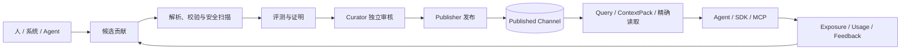

# Agent Knowledge Platform

面向 Agent 的知识与能力沉淀平台。目标不只是提供传统的检索增强生成（RAG），而是建立一套可持续演进的知识生态：Agent 能发现、学习和使用知识，也能将经过验证的新知识与能力贡献回平台。

> [!IMPORTANT]
> 当前版本是可运行的 **AKEP v0.1 实验基线**，适合本地开发和受控的单租户隔离试点，尚不适合直接暴露到公网或用于多租户生产环境。AKEP（Agent Knowledge Exchange Protocol）是本项目的实验协议草案，并非已发布的公共标准。

## 导航

- [核心闭环](#核心闭环) · [设计原则](#首要设计原则) · [系统组成](#系统组成)
- [当前能力](#可运行的-phase-1-开发基线) · [快速开始](#快速开始) · [开发身份](#开发角色令牌)
- [验证](#验证) · [Agent 接入](#agent-接入) · [项目结构](#项目结构) · [文档索引](#文档索引)
- [生产边界](#生产边界) · [下一步](#下一步产品决策)

## 核心闭环

1. 人、系统或 Agent 上传原始知识与能力资产。
2. 平台完成解析、结构化、去重、版本化和权限标注。
3. Agent 按任务检索并使用合适的知识或能力。
4. 平台记录引用关系、使用过程和效果反馈。
5. Agent 将新发现、经验总结、失败教训或能力包作为候选贡献提交。
6. 候选内容经过自动校验、评测、审核与可信度分级后发布。
7. 新版本重新进入知识网络，形成可追踪的持续演进闭环。

## 首要设计原则

- **来源可追溯**：任何知识都要保留来源、作者、时间、证据和生成链路。
- **版本不可覆盖**：知识修订产生新版本，支持比较、回滚、废弃和依赖分析。
- **事实与经验分层**：区分事实、观点、流程、案例、记忆、提示词、工具和可执行能力。
- **贡献不等于发布**：Agent 上传的内容默认进入候选区，不能直接污染正式知识库。
- **效果可评估**：记录知识被谁、在什么任务中使用，以及是否真正改善结果。
- **权限贯穿全链路**：采集、索引、检索、推理、分享和导出都必须遵守租户与访问控制。
- **模型与存储可替换**：领域模型、检索引擎、向量库和大模型通过稳定接口解耦。

## 核心领域

- 知识资产：文档、片段、结构化事实、规则、案例、数据集和知识图谱。
- 能力资产：提示词、Skill、Tool、工作流、Agent 配置、评测集和运行依赖。
- 知识接入：上传、连接器、解析、切分、抽取、清洗、去重和索引。
- 知识服务：搜索、语义检索、图谱查询、上下文组装、引用和 SDK/API。
- 贡献系统：草稿、候选提交、证据绑定、差异比较、审核和合并。
- 治理系统：身份、权限、密级、许可证、质量、可信度、生命周期和审计。
- 演进系统：使用反馈、离线评测、冲突检测、知识衰减、晋级与淘汰。

## 系统组成



| 组件 | 职责 | 技术基线 |
| --- | --- | --- |
| `apps/core` | AKEP HTTP API、认证授权、契约校验、治理事务和查询 | Node.js 24、TypeScript、Fastify |
| `apps/web` | 知识、贡献、审核、发布、评测和 Agent 接入控制台 | React 19、Vite |
| `workers/knowledge-worker` | 规范化、确定性切片、Manifest/Revision 校验和静态安全扫描 | Python 3.13+ |
| `infra/postgres` | 不可变 Revision、生命周期、收据、Outbox 和检索投影 | PostgreSQL 17、pgvector 0.8.2 |
| `packages/sdk-*` | TypeScript / Python 客户端 | AKEP v0.1 |
| `apps/mcp-server` | 面向 Agent 的 MCP stdio Adapter | MCP SDK、AKEP SDK |
| `specs/akep/v0.1` | OpenAPI、JSON Schema、Profile 和一致性样例 | OpenAPI 3.1、JSON Schema 2020-12 |

协议核心保持模块化单体，知识处理 Worker 与数据库权限隔离；MCP、SDK 和 Web Console 都通过同一套 AKEP 资源与治理边界接入。

## Phase 1 验证范围

当前阶段聚焦最小但完整的受治理闭环：

1. 支持文档上传、解析、版本管理和带引用的检索。
2. 为 Agent 提供统一的搜索、读取和候选知识提交 API。
3. 建立候选区与人工审核发布流程。
4. 记录每次知识使用及其任务反馈。
5. 用小规模评测集验证知识更新是否带来真实收益。

## 文档索引

- [总体技术方案 v0.1](docs/architecture/technical-design-v0.1.md)：架构不变量、领域模型、存储、安全、部署和路线图。
- [AKEP v0.1 协议草案](docs/protocols/akep-v0.1.md)：知识身份、查询、贡献、反馈、事件、联邦及 MCP/A2A 适配。
- [机器可读协议](specs/akep/v0.1/README.md)：OpenAPI 3.1、JSON Schema 2020-12、示例与 Revision 哈希测试向量。
- [信任与发布治理](docs/governance/trust-and-publication.md)：质量信号、风险分级、发布门禁和紧急撤销。
- 架构决策：[ADR-0001](docs/architecture/adr/0001-protocol-first-modular-monolith.md)、[ADR-0002](docs/architecture/adr/0002-content-addressed-revisions.md)。

AKEP 是项目内的实验性工作名和 v0.1 草案，尚不是公共标准。首个实现应以契约测试和最小闭环验证其语义，再讨论稳定命名与外部标准化。

## 可运行的 Phase 1 开发基线

当前实现采用 **Node.js 24 + TypeScript** 作为协议核心，采用 **Python** 作为隔离的知识处理
Worker。Node.js 负责 HTTP、认证、契约校验和事务边界；Python 负责 Manifest 校验、JCS
摘要等无状态任务。PostgreSQL + pgvector 是规范元数据、收据与可重建检索投影的初始存储。

已经具备：

- 响应式 Web Console：总览、知识检索、贡献向导、独立审核、发布治理、效果证据、Agent 接入和平台设置。
- 首次访问五步引导：真实完成能力发现、候选创建、Profile 证明链、角色分离审核/发布、带引用检索和 Agent 接入说明。
- AKEP Reader、Contributor、Curator、Publisher 能力发现，40 个公开 Schema、健康检查和统一 Problem Details。
- 相互隔离的开发角色令牌，以及版本、用途、义务、幂等键和工作流 ETag 校验。
- 候选贡献、证据补充、撤回、独立审核、事务化发布、废弃、撤销和擦除动作。
- Published Channel 上的词法/精确 Passage 检索、快照游标、预算化 ContextPack、不可变 Manifest 读取、完整/Range Blob 读取和稳定引用。
- 不可变 EvaluationRun/Attestation 质量证据；发布逐项满足 Profile 的 `requiredAttestations`。Schema/安全证明来自服务端实际执行，审核与策略证明分别绑定 Curator/Publisher；benchmark 只接受真实 EvaluationRun，不再由前端伪造。
- 受主体、用途、策略、有效期及撤销状态约束的 Exposure → Usage → Feedback 证据链。
- TypeScript/Python SDK 与独立 MCP stdio Adapter；MCP 只适配 search/context/get/usage/feedback/candidate，不拥有治理权限。
- OIDC Remote JWKS 生产认证、全局限流、安全响应头、Trace Context、可选 OTLP trace、Prometheus 指标与 SLO 健康视图。
- TypeScript/Python 共用的 Manifest Schema 与跨语言 Revision ID 黄金向量。
- PostgreSQL 不可变 Revision、生命周期事实、检索投影、Outbox、Receipt 和版本化迁移。

## 快速开始

### 环境要求

- Docker 与 Docker Compose。
- 宿主机开发需要 Node.js 24、Corepack 和 pnpm 11。
- 执行完整校验还需要 Python 3.13 或 3.14 与 `uv`。

### 完整容器环境

```bash
git clone git@github.com:tiammomo/agent-knowledge-platform.git
cd agent-knowledge-platform
docker compose --profile app up --build
```

打开 `http://localhost:8080` 进入 Web Console，首次访问会自动启动五步引导。Web 入口会将 AKEP API 代理到 Core；Core 仍可通过 `http://localhost:3000` 直接访问。

如端口被占用，可显式指定宿主机端口：

```bash
AKEP_HOST_PORT=43117 AKEP_WEB_PORT=43118 docker compose --profile app up --build
```

### 宿主机开发

本地启动数据库和核心服务：

```bash
corepack enable
pnpm install
docker compose up -d postgres
cp .env.example .env
pnpm db:migrate
pnpm dev
```

另开一个终端启动 Vite 开发服务器：

```bash
pnpm dev:web
```

浏览器打开 `http://localhost:5173`。开发服务器会代理本地 `3000` 端口的 Core API；所有引导动作都会调用真实 AKEP API，并写入 PostgreSQL。

## 开发角色令牌

以下令牌只允许用于非生产环境：

| 令牌 | 角色 |
| --- | --- |
| `dev-reader` | 查询、读取、Usage、Feedback |
| `dev-contributor` | 候选贡献、证据补充、撤回 |
| `dev-evaluator` | 提交真实 EvaluationRun，不可审核/发布 |
| `dev-curator` | 审核与验证，不可发布 |
| `dev-publisher` | 发布与废弃，不可紧急撤销/擦除 |
| `dev-incident` | 紧急撤销 |
| `dev-eraser` | 隐私或法律擦除 |
| `dev-console` | 本地全局 Console 只读投影 |
| `dev-observer` | Prometheus 指标采集 |

## 验证

验证类型、单元测试、公开契约、SDK 和 Python Worker 基线：

```bash
pnpm check
```

数据库运行时和完整成长闭环验证：

```bash
pnpm test:integration
```

对已经启动的统一 Web 入口执行完整 UI/API 烟雾闭环：

```bash
AKEP_WEB_ORIGIN=http://localhost:8080 pnpm smoke:web
```

详细操作见[本地开发运行手册](docs/runbooks/local-development.md)，当前能力与生产缺口见[实现状态](docs/architecture/implementation-status.md)。

## Agent 接入

Agent 接入可直接参考 [TypeScript SDK](packages/sdk-ts/README.md)、
[Python SDK](packages/sdk-python/README.md) 与 [MCP Adapter](apps/mcp-server/README.md)。
单租户隔离试点的 OIDC、数据库和观测配置见[生产试点运行手册](docs/runbooks/production-pilot.md)。

Web 信息架构、交互约束和新手引导验收见
[Web Console 与新手引导](docs/product/web-console-and-onboarding.md)。

## 项目结构

```text
.
├── apps/
│   ├── core/              # AKEP API 与治理核心
│   ├── web/               # Web Console
│   └── mcp-server/        # MCP stdio Adapter
├── packages/
│   ├── sdk-ts/            # TypeScript SDK
│   └── sdk-python/        # Python SDK
├── workers/
│   └── knowledge-worker/  # 隔离的 Python 知识处理 Worker
├── specs/akep/v0.1/       # OpenAPI、Schema、Profile 与样例
├── contracts/internal/    # Core 与 Worker 的内部任务契约
├── infra/                 # Docker、PostgreSQL 迁移与校验脚本
├── docs/                  # 架构、协议、治理、产品与运行手册
└── compose.yaml           # 本地完整运行环境
```

## 生产边界

当前仓库已完成受治理知识成长闭环，以及 OIDC、基础可观测性、SDK/MCP 和评测门禁，但仍只适合受控的单租户隔离试点。扩大生产范围前必须补齐：

- 外部 PDP、租户级 PostgreSQL RLS 与完整越权测试。
- 加密对象存储、隔离上传区、独立恶意文件扫描和擦除证明。
- 高可用观测、审计安全日志、备份恢复、密钥轮换与容量验收。
- 语义/混合检索的授权下推、固定模型指纹和召回评测。

应用在 `NODE_ENV=production` 下会拒绝开发认证启动，不能通过配置绕过。完整门禁见[实现状态](docs/architecture/implementation-status.md)和[生产试点运行手册](docs/runbooks/production-pilot.md)。

## 下一步产品决策

- 产品名称、首批用户和最优先的使用场景。
- 单租户私有部署或多租户平台形态。
- 首批知识类型，以及是否同时承载可执行 Agent 能力。
- 生产身份源及 tenant/group claim 映射、外部 PDP、部署方式、数据安全等级和成本边界。
- 自动发布的准入标准，以及人类审核在各知识等级中的职责。

跨组织联邦、语义嵌入、可执行能力包及自动晋级仍保持关闭，直到相应的安全、质量和运维门禁完成。
