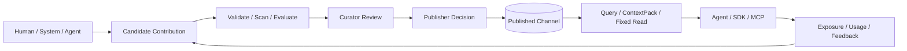

# Agent Knowledge Platform

面向 Agent 的可验证知识与能力沉淀平台：让 Agent 不仅能检索知识，还能提交候选、绑定证据、
参与评测，并在职责分离的治理流程后形成可追踪的新版本。

**当前状态：** AKEP v0.1 实验参考实现 · 可本地运行 · 仅适合受控的单租户隔离试点

> [!IMPORTANT]
> AKEP（Agent Knowledge Exchange Protocol）是本项目的实验协议草案，不是已发布的公共标准。
> 当前版本尚未完成多租户、公网生产、监管级擦除或大规模语义检索验收。

[快速开始](#快速开始) · [当前能力](#当前能力) · [接入维护与隔离](#接入维护与隔离) ·
[文档](#文档) · [协作与安全](#协作与安全) · [生产边界](#生产边界)

## 为什么不只是 RAG

传统 RAG 通常聚焦“切片、索引、召回”。本项目把知识消费前后的治理事实也纳入核心模型：

- **来源可追溯**：保留作者、生成活动、原始来源、证据和策略。
- **版本不可覆盖**：Manifest 内容寻址；修订产生新 Revision，历史引用可复现。
- **候选与发布隔离**：Agent 贡献默认进入 Candidate，不能直接污染 Published Channel。
- **权限贯穿全链路**：授权在召回、读取和上下文组装前执行，并考虑 Space、用途、策略和义务。
- **质量不是单一分数**：Schema、安全扫描、评测、人工审核、时效和冲突分别形成 Attestation。
- **效果形成证据**：Exposure → Usage → Feedback 可追踪，但反馈不能直接改正文或发布状态。
- **数据与代码分离**：知识正文始终是不可信数据；可执行能力必须走独立制品供应链与沙箱。

## 核心闭环



贡献成功不等于发布成功。Contributor、Evaluator、Curator、Publisher、Incident Responder 和
Eraser 使用不同权限；高风险状态变化必须绑定固定 Revision、证据、策略版本、幂等键和 ETag。

## 当前能力

| 能力面 | 当前实现 |
| --- | --- |
| 知识生命周期 | create/revise 候选、补证、撤回、独立审核、发布、废弃、撤销和试点 erase |
| 版本与引用 | RFC 8785 JCS + SHA-256 Revision ID、不可变 Manifest、稳定 Citation、Range Blob |
| 查询 | Published Channel lexical/exact Query、快照游标、预算化 ContextPack |
| 质量门禁 | Profile Required Attestations、静态内容扫描、EvaluationRun、Curator/Publisher 证明 |
| 效果证据 | 受主体、用途、策略、有效期和撤销约束的 Exposure → Usage → Feedback |
| 协议 | AKEP v0.1、OpenAPI 3.1、40 个 JSON Schema、2 个 Phase 1 Profile 和一致性样例 |
| Agent 接入 | TypeScript SDK、Python SDK、独立 MCP stdio Adapter |
| Web Console | 总览、知识、贡献、审核、发布治理、效果证据、Agent 接入和设置；五步真实引导 |
| 平台基线 | PostgreSQL 17 + pgvector、17 张租户事实表 FORCE RLS、OIDC Remote JWKS、限流、安全头、OTLP trace、Prometheus/SLO |
| Worker | 隔离的 Python JSONL Worker：规范化、切片、摘要校验和静态扫描；默认 Compose 不启动 |

当前只启用 `source_document` 与 `procedure` Profile，以及 lexical/exact 查询。Federation、
A2A Adapter、外部 Ingestion Connector、semantic/hybrid Query、自动晋级和可执行能力包保持关闭。
详见[实现状态与生产门禁](docs/architecture/implementation-status.md)。

## 快速开始

### 完整容器环境

只需要 Docker 与 Docker Compose：

```bash
git clone git@github.com:tiammomo/agent-knowledge-platform.git
cd agent-knowledge-platform
docker compose --profile app up --build
```

打开 `http://localhost:8080`。首次访问会启动五步引导，并通过真实 API 完成：

```text
Discovery → Candidate → Attestations/Review → Publish → Cited Query
```

常用入口：

| 地址 | 用途 |
| --- | --- |
| `http://localhost:8080` | Web Console 与统一 Web Origin |
| `http://localhost:3000` | Core 直连调试 |
| `http://localhost:3000/.well-known/akep` | Capability Discovery |
| `http://localhost:3000/health/ready` | 就绪检查 |

端口冲突时：

```bash
AKEP_HOST_PORT=43117 AKEP_WEB_PORT=43118 docker compose --profile app up --build
```

### 宿主机开发

需要 Node.js 24、Corepack/pnpm 11、Python 3.13/3.14、uv 和 Docker Compose：

```bash
corepack enable
pnpm install
docker compose up -d postgres
cp .env.example .env
pnpm db:migrate
pnpm dev
```

另开终端运行 `pnpm dev:web`，访问 `http://localhost:5173`。完整步骤、开发身份和排障见
[本地开发运行手册](docs/runbooks/local-development.md)。

## 验证

```bash
# 类型、单元测试、协议契约、SDK/MCP 与 Python Worker
pnpm check

# 全部生产构建
pnpm build

# PostgreSQL 事务、迁移、不变量和完整成长闭环
pnpm test:integration

# 对已启动的统一 Web Origin 执行真实 UI/API 烟雾闭环（会写入随机示例）
AKEP_WEB_ORIGIN=http://localhost:8080 pnpm smoke:web
```

`pnpm check` 覆盖 Core/Web 测试、40 个公开 Schema、8 个协议样例、2 个 Profile、JCS 黄金向量、
Markdown 本地链接/锚点、TypeScript/Python SDK、MCP 类型、Worker Ruff 和 Pytest。

## 协作与安全

Pull Request 会执行类型、测试、契约、文档、构建和 PostgreSQL 集成验证；独立安全工作流执行
生产依赖审计、Secret 扫描、生产镜像构建和 High/Critical 漏洞门禁。GitHub Actions、Docker、
Compose 与 uv 依赖由 Dependabot 定期检查。

- 贡献约定与本地验证：[CONTRIBUTING.md](CONTRIBUTING.md)
- 私密漏洞报告与生产基线：[SECURITY.md](SECURITY.md)
- 当前实现与上线门禁：[实现状态](docs/architecture/implementation-status.md)

## Agent 接入

Agent 应先读取 `/.well-known/akep`，再按实例声明的 Profile、Operation、Extension 和限制调用，
不要仅凭 OpenAPI 推断运行能力。

- [TypeScript SDK](packages/sdk-ts/README.md)：Query、ContextPack、固定 Revision、
  Usage/Feedback 和候选贡献。
- [Python SDK](packages/sdk-python/README.md)：适合 Worker、评测作业和 Agent 服务的轻量客户端。
- [MCP Adapter](apps/mcp-server/README.md)：`knowledge_search`、`knowledge_context`、
  `knowledge_get`、Usage/Feedback 和候选提交；不暴露治理权限。
- [HTTP API 快速参考](docs/reference/http-api.md)：Base URL、请求头、Scope、端点和 cURL。

本地 `dev-*` token 只用于非生产角色演示。OIDC 模式下必须使用短期、audience-bound token，
并通过签名 `akep_obligations` claim 发放调用方真正能够履行的义务。

## 接入、维护与隔离

这三项使用同一套 Tenant/Space、身份、策略、Revision 和事件模型：

| 问题 | 设计结论 | 详细文档 |
| --- | --- | --- |
| 外部系统如何快速接入 | Discovery → OIDC workload → 单 Space 只读 canary；REST/SDK/MCP 优先，写入只创建 Candidate | [外部接入设计](docs/architecture/external-integration.md)、[接入手册](docs/runbooks/external-system-onboarding.md) |
| 知识如何持续维护 | 每个 Published adoption 必须有 Owner、维护策略、来源 checkpoint、`reviewAfter`、证据与明确退出动作 | [持续维护设计](docs/governance/knowledge-maintenance.md) |
| 团队如何隔离和共享 | Tenant 是硬安全边界，Space 是团队治理边界；团队默认不可互读，经 Shared Space adoption/reference/copy 共享 | [多团队隔离设计](docs/architecture/multi-team-isolation.md)、[ADR-0003](docs/architecture/adr/0003-tenant-space-isolation-and-controlled-sharing.md) |

当前运行时仍是单租户进程模型：Core 将专用连接池固定绑定到 `AKEP_TENANT_ID`，全部 17 张
租户事实表具有非空 `tenant_id`、租户复合约束与 PostgreSQL `ENABLE/FORCE RLS`；production
readiness 会校验 owner 管理的数据库角色 → Tenant 绑定，并拒绝 table owner、superuser 和
`BYPASSRLS` 运行角色。它解决的是单租户部署中的
数据库纵深防御，不等于共享多租户运行时。可信 Principal → Tenant 映射、事务级动态 Tenant、
外部 PDP、Space 共享工作流、对象/缓存/队列隔离和完整侧信道验收仍未完成。

## 项目结构

```text
.
├── apps/
│   ├── core/              # AKEP HTTP、授权、治理、事务与查询
│   ├── web/               # React Web Console
│   └── mcp-server/        # 独立 MCP stdio Adapter
├── packages/
│   ├── sdk-ts/            # TypeScript SDK
│   └── sdk-python/        # Python SDK
├── workers/
│   └── knowledge-worker/  # 无数据库权限的 Python Worker
├── specs/akep/v0.1/       # OpenAPI、JSON Schema、Profile 和测试向量
├── contracts/internal/    # Core / Worker 版本化任务契约
├── infra/                 # Docker、PostgreSQL 迁移与验证脚本
├── docs/                  # 架构、协议、治理、产品、API 与运行手册
├── scripts/               # 文档完整性等仓库级检查
└── compose.yaml           # 本地 Web/Core/PostgreSQL 环境
```

## 文档

完整阅读路径见[文档中心](docs/README.md)。

| 主题 | 文档 |
| --- | --- |
| 当前组件与数据边界 | [系统概览](docs/architecture/system-overview.md) |
| 外部系统快速接入 | [接入设计](docs/architecture/external-integration.md)、[运行手册](docs/runbooks/external-system-onboarding.md) |
| 知识持续维护 | [维护与质量运营](docs/governance/knowledge-maintenance.md) |
| 多团队隔离/共享 | [隔离设计](docs/architecture/multi-team-isolation.md) |
| 当前完成度与生产缺口 | [实现状态](docs/architecture/implementation-status.md) |
| 架构不变量与目标形态 | [技术方案 v0.1](docs/architecture/technical-design-v0.1.md) |
| AKEP 规范语义 | [协议草案](docs/protocols/akep-v0.1.md) |
| OpenAPI / Schema / Profile | [机器可读契约](specs/akep/v0.1/README.md) |
| 信任与发布 | [治理基线](docs/governance/trust-and-publication.md) |
| Web 产品与验收 | [Console 与新手引导](docs/product/web-console-and-onboarding.md) |
| 试点部署 | [隔离生产试点运行手册](docs/runbooks/production-pilot.md) |

## 生产边界

当前实现可以作为受控单租户隔离试点的技术基线，但扩大部署前至少还要完成：

1. 在现有全表 Tenant/RLS 基线上完成可信 Principal → Tenant 映射、事务级动态 Tenant、外部 PDP、
   Space 授权下推以及对象/缓存/队列/侧信道的完整越权验收。
2. 加密对象存储、隔离上传、独立恶意文件扫描、解析沙箱和擦除证明。
3. Integration/Connector 控制面、维护调度/Owner/SLA、Outbox relay 和停用演练。
4. 高可用观测、审计安全日志、备份恢复、密钥轮换、迁移回滚和容量演练。
5. 语义/混合检索的授权下推、模型指纹、召回评测和重建流程。
6. 生产 Web 会话、短期 token 刷新、高权限二次确认与安全验收。

`NODE_ENV=production` 会拒绝 development auth，不能通过配置绕过。上线前使用
[试点 Go/No-Go 清单](docs/runbooks/production-pilot.md#0-go-no-go-检查)，不要把当前
`dev-*` token、浏览器开发 bundle 或试点 erase 回执用于生产声明。

## 项目方向

近期重点是用真实用户、真实知识和固定评测集验证：

- 首个高价值场景与成功指标。
- source document / procedure 之外的下一批 Profile。
- lexical 基线达到什么条件后引入语义/混合检索。
- 可信多租户 Principal、外部 PDP、对象/缓存/队列隔离与 Shared Space 的落地顺序。
- 自动发布严格限定在哪些低风险、可机器验证的资产。

项目与协议许可证、公共命名空间及 conformance 治理尚未最终确定；在这些决策完成前，不对外
声称 AKEP 是公共标准或参考实现已达到通用生产合规。
