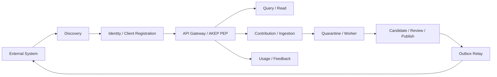
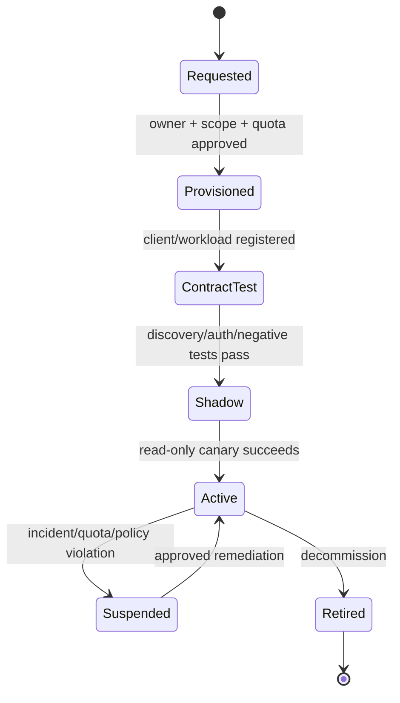

# 外部系统接入设计

- 状态：目标设计；含当前可用路径
- 最近核对：2026-07-17
- 适用范围：业务系统、数据源、Agent 平台、评测作业和 MCP Host
- 关联设计：[知识持续维护](../governance/knowledge-maintenance.md)、
  [多团队隔离](multi-team-isolation.md)

目标是在不牺牲来源、权限和治理的前提下，让外部系统完成“发现 → 认证 → 最小调用 →
逐步放量 → 可观测 → 可撤销”的接入。快速接入不等于跳过安全门禁；任何外部写入默认只能形成
Candidate，不能直接改变 Published Channel。

> [!IMPORTANT]
> 当前参考实现已经提供 Capability Discovery、RFC 9728 metadata、OIDC Remote JWKS、
> REST/TypeScript/Python SDK 和 MCP Adapter；外部 Ingestion Connector、集成控制面、Outbox relay
> 与 webhook 注册尚未实现。本设计中的目标端点和控制面对象不能当作当前 API。

## 1. 接入面分层

平台把接入拆成四个面：

| 接入面 | 用途 | 当前能力 | 目标能力 |
| --- | --- | --- | --- |
| Discovery | 发现版本、操作、Schema、限制和授权服务器 | `/.well-known/akep`、RFC 9728 metadata | 按租户/区域返回短期、可签名 Capability |
| 在线消费 | Query、ContextPack、固定 Revision/Blob | REST、TS/Python SDK、MCP | 租户路由、配额套餐、授权计划缓存 |
| 知识写入 | 规范 Manifest、原始文件、业务源同步 | `/contributions` | `/ingestions` 运行时、Connector control plane、隔离对象区 |
| 证据/事件 | Usage、Feedback、状态通知 | Usage/Feedback、事务 Outbox | CloudEvents relay、订阅、Delivery/ACK、重放 |

Federation 和 A2A 不作为普通业务系统的快速接入方式。Federation 是跨信任域同步协议，必须完成
签名、防重放和本地重新治理；A2A 是 Agent 任务适配器，不能替代知识写入与治理。

## 2. 推荐接入模式

### 2.1 在线查询：REST / SDK

适合客服、搜索、工作流和业务后端。推荐顺序：

1. 读取 AKEP Capability 与 OAuth Protected Resource Metadata。
2. 使用 `resource`/audience-bound 的短期 access token 调用。
3. 从 lexical/exact Query 起步，只选择 discovery 明确声明的模式。
4. 使用服务端 Citation 和 Exposure Receipt；实际采用知识后写 Usage，需要效果证据时写 Feedback。
5. 缓存只保存固定 Revision，Record Head 与策略相关结果按短 TTL 重新判定。

SDK 只封装协议细节，不持有第二事实源。外部系统必须保存 `X-Request-Id`、业务 correlation ID、
Revision/Citation 和自己的幂等键，不能保存 bearer token 或未经批准的 Payload 到日志。

### 2.2 Agent Host：MCP

MCP Adapter 适合模型宿主快速获得 search/context/get/feedback/candidate 工具。每个 Adapter 实例
绑定一个最小权限 workload credential；只读 Agent 不获得 contribute，任何 Agent 都不获得
review/publish/incident/erase。MCP Tool annotation 只用于客户端提示，授权仍由 AKEP 执行。

### 2.3 规范写入：Contribution

已经能构造 Manifest、Payload digest 和 JCS Revision ID 的外部系统直接调用
`POST /contributions`。这一方式适合内部内容平台、GitOps 作业和确定性转换程序：

- `clientSubmissionId` 在来源系统内稳定，`Idempotency-Key` 在重试时复用。
- `recordId` 映射稳定业务对象，来源版本变化生成 revise，不创建无关联的新 Record。
- Payload digest、来源 URI、生成活动、Owner、许可证、用途和 `reviewAfter` 必须在进入平台前确定。
- 响应是 Candidate receipt，不是发布证明。

### 2.4 原始文件/业务源：Connector + Ingestion（目标）

不能可靠构造 Manifest 的系统使用受控 Connector。平台不提供“任意 URL 抓取”：

1. Connector 从已登记 provider、仓库、bucket 或 SaaS API 拉取，凭据保存在 Secret Manager。
2. 原始字节先进入 `tenant/integration/ingestion` 隔离前缀，不能被 Query 读取。
3. 独立扫描、媒体解析沙箱、格式规范化和 DLP 完成后才计算 digest。
4. 映射器按固定版本生成 Manifest/Profile，调用普通 Contribution 创建 Candidate。
5. 失败写可授权 Problem，隔离对象按保留策略清理；失败不得产生 Published 半成品。

Push Connector 使用预签名上传会话或 multipart Ingestion；Pull Connector 使用平台控制的 egress
allowlist。二者共享相同任务信封、扫描、幂等和 Candidate 语义。

## 3. 集成控制面（目标）

每个外部接入都登记为 `Integration`，而不是只发一个长期 token：

| 字段 | 作用 |
| --- | --- |
| `integrationId` | 平台稳定身份，不复用 client secret |
| `tenantId` | 从管理上下文确定，不接受数据面请求自报 |
| `ownerTeam / technicalOwner / securityOwner` | 业务、运维和安全责任人 |
| `clientId / workloadIdentity` | IdP 中的机器身份 |
| `allowedSpaces / operations / purposes` | 可编译的最小授权上限 |
| `supportedObligations` | 客户端确实能履行的 cite/no-train 等义务 |
| `rateLimitProfile / quota` | 请求、并发、字节、Contribution 和事件额度 |
| `connectorRef / mappingVersion` | 可选 Connector 与确定性映射版本 |
| `credentialVersion / expiresAt` | 轮换和过期控制，不存明文 secret |
| `status` | requested、active、suspended、revoked、retired |
| `lastSeenAt / lastSuccessfulSyncAt` | 运行健康，不作为知识正确性证明 |

控制面与 AKEP 数据面分离。`/control/v1/integrations` 等管理 API 属于未来私有控制面，不进入
AKEP Core 互操作协议；其写操作要求管理员身份、审批、审计和双人控制（高权限情况）。

## 4. 身份与授权

### 4.1 认证

- 人类使用 OIDC Authorization Code + PKCE；机器使用 client credentials、workload identity、
  mTLS/private_key_jwt，避免共享长期 bearer secret。
- Resource Server 发布 RFC 9728 metadata；客户端请求 RFC 8707 audience/resource 限定 token。
- 生产遵循 RFC 9700；高风险接入使用 mTLS 或 DPoP sender-constrained token。
- 用户/Group 生命周期可由 SCIM 2.0 同步到身份/策略控制面，但 SCIM Group 不能直接成为数据面授权。
- Agent 代表用户调用下游时优先用 RFC 8693 delegation/token exchange，保留当前 actor；
  不允许 Agent 冒充用户而丢失 actor 链。

### 4.2 授权

内部 `Principal` 至少包含可信 `tenantId`、`subject`、`actor`、`groups`、`scopes`、
`supportedObligations` 和 token 时间边界。原始 IdP claim 名称可配置映射，但：

- `tenantId` 只能来自 issuer + client/subject 的管理映射或签名 claim，不能来自 URL/body/header。
- 请求中的 Space、purpose、filters 和 obligations 只能缩小授权。
- PDP 输出短期 `AuthorizationPlan`，绑定 tenant、subject/actor、Space、operation、purpose、
  policy digest、policy epoch 和过期时间。
- Query 在召回、排序和 LIMIT 前执行 Plan；精确读取、Blob 和 Usage/Feedback 再复核。
- Integration 被 suspended/revoked、Group 变化或策略收紧时递增安全水位，使缓存和旧 Receipt 失效。

## 5. Connector 一致性模型

每个 Connector 保存版本化 Checkpoint：

| 状态 | 必备内容 |
| --- | --- |
| source checkpoint | provider tenant/site、cursor/version、观察时间、mapping version |
| source object map | external object ID、source version/digest、recordId、last revisionId |
| sync run | window、开始/完成时间、输入/输出计数、错误摘要、任务 trace |
| delivery state | event source+id、attempt、next attempt、ACK/死信状态 |

处理规则：

- 同一 source version/digest 重放不创建新 Revision。
- 内容变化创建 revise Candidate，并把旧 Revision 作为 parent/base。
- 来源重命名不改变 recordId；来源身份真正变化时才新建 Record。
- 来源删除默认创建 deprecate 候选；只有隐私/法律策略才能创建 erase 候选。
- 来源权限收紧先 fail closed，再异步清理/复审；不能等下一次全量同步。
- cursor 丢失执行带重叠窗口的重扫，并按 external ID + digest 幂等。
- 映射器升级不会静默批量重写；先 dry-run diff、抽样评测，再按批次创建候选。

## 6. 事件与回调（目标）

Outbox relay 使用 CloudEvents 1.0 JSON，至少一次、允许乱序：

- 订阅按 tenant、Space、event type 和风险过滤，不能扩大订阅者原有读取权限。
- 事件只带最小元数据与固定资源引用，不携带正文、token 或敏感策略解释。
- 接收方按 `source + id` 幂等，不能依赖投递顺序。
- webhook 使用 mTLS/OAuth 工作负载身份，带超时、指数退避、最大尝试和 DLQ。
- 撤销/权限收紧事件使用独立高优先队列；失败超过 SLA 时暂停该订阅者的后续敏感共享。
- Replay 必须在当前授权下重新生成投递集，不能重放已失权内容。

## 7. 快速接入流程

最快安全路径是“只读、单 Space、单 purpose、小配额”：

1. 确定 Owner、数据分类、Space、purpose、义务和流量上限。
2. 注册 workload client，签发 audience-bound 短期 token。
3. 通过 discovery、Schema、401/403/404、限流和零结果测试。
4. Shadow 模式只记录预期请求，不返回正文；随后 read-only canary。
5. 接入 Citation、Usage 和错误/指标后逐步放量。
6. 只有确有需要才增加 Contribution；治理权限永不授予普通 Integration。

操作清单见[外部系统接入运行手册](../runbooks/external-system-onboarding.md)。

## 8. 配额、SLO 与可观测性

配额至少按 `tenant + integration` 统计：

- 请求速率、并发、查询预算、返回字符/字节、Blob 下载字节。
- Ingestion 单文件/每日字节、待处理任务、Contribution 和事件投递。
- 错误预算与最大积压；单一 Integration 不能耗尽全租户 Worker/数据库连接。

指标包含 integrationId 的不可逆内部标识、状态码、operation、延迟和字节，不包含正文、查询文本、
token、原始 subject 或外部 source URL。Trace/Baggage 跨出信任域前做 allowlist/redaction。

## 9. 停用与事故

停用顺序：

1. suspend Integration，拒绝新 token/请求并使授权缓存失效。
2. 取消 Connector 调度和 webhook，等待或隔离进行中任务。
3. 在 IdP/Secret Manager 撤销凭据，保留不可变审计和必要回执。
4. 明确保留、deprecate、revoke 或 erase 已贡献知识；停用客户端不自动删除知识。
5. 清理临时对象、DLQ 和非必要遥测，验证无法继续读取或重放。

凭据泄漏、越权或投毒事件优先 suspend + fail closed，再调查和恢复。不能通过删除日志或旧
Contribution 来“修复”事故。

## 10. 验收标准

- 新 Integration 能在不人工修改代码的情况下完成 discovery、OIDC 和单 Space 只读调用。
- 错误 audience、tenant、Space、purpose、obligation、scope 和过期 token 全部拒绝。
- Connector 重放不创建重复 Revision，删除/权限收紧不会直接 erase 或继续分发。
- 任一写入都只创建 Candidate；Integration 永远不能 self-review/self-publish。
- Integration suspend 后，新请求立即拒绝，旧 Receipt/cache 在策略水位变化后 fail closed。
- 配额和 Worker 隔离能抵御单 Integration 的突发流量。
- 事件重复、乱序、超时和重放测试通过，撤销事件满足更高优先级/SLA。
- 停用演练证明 token、Connector、webhook 和临时对象全部失效，审计事实仍可追踪。

## 11. 实施顺序

1. **I0 当前快速路径**：Discovery + OIDC + REST/SDK/MCP，单租户、人工注册。
2. **I1 Integration Registry**：Owner、client、Space、purpose、quota、状态和审计。
3. **I2 动态租户上下文/PDP**：全表 Tenant/RLS 基线已完成；可信 Principal Tenant、事务级动态
   上下文与全链路隔离完成后才允许共享运行时。
4. **I3 Ingestion Runtime**：隔离对象区、扫描/解析沙箱、Connector checkpoint、Candidate。
5. **I4 Outbox Relay**：CloudEvents、订阅、ACK/DLQ、撤销优先。
6. **I5 自助接入**：审批模板、contract test、canary、轮换、停用和成本归属。

I2 是 I3/I4 多团队部署的前置条件；不能先把 Connector 或事件总线做成跨租户共享，再补隔离。

## 12. 采用的标准

- [OAuth 2.0 Security Best Current Practice — RFC 9700](https://www.rfc-editor.org/info/rfc9700/)
- [OAuth 2.0 Protected Resource Metadata — RFC 9728](https://www.rfc-editor.org/info/rfc9728/)
- [Resource Indicators for OAuth 2.0 — RFC 8707](https://www.rfc-editor.org/info/rfc8707/)
- [OAuth 2.0 Token Exchange — RFC 8693](https://www.rfc-editor.org/info/rfc8693/)
- [SCIM Protocol — RFC 7644](https://www.rfc-editor.org/info/rfc7644/)
- [CloudEvents specification](https://github.com/cloudevents/spec)
- [OpenTelemetry sensitive data guidance](https://opentelemetry.io/docs/security/handling-sensitive-data/)
