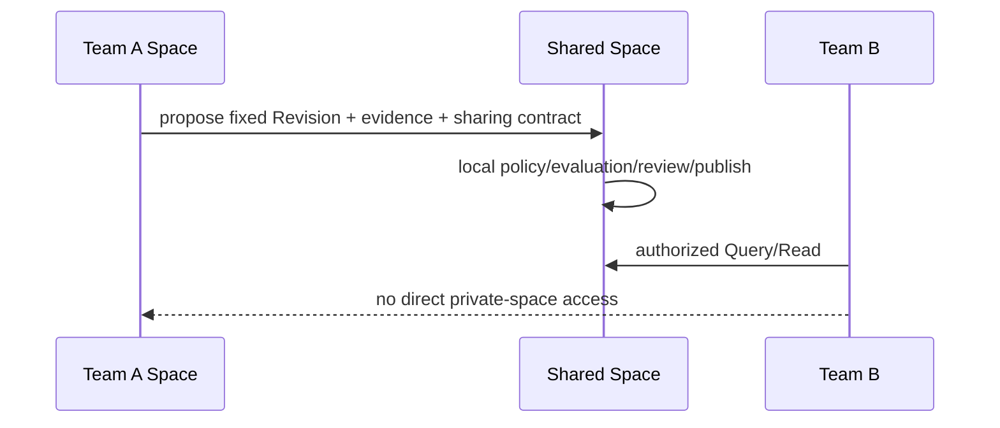

# 多团队知识隔离与受控共享设计

- 状态：数据库 Tenant 硬边界已实现；共享多租户运行时仍是目标设计
- 最近核对：2026-07-17
- 决策记录：[ADR-0003](adr/0003-tenant-space-isolation-and-controlled-sharing.md)
- 关联设计：[外部系统接入](external-integration.md)、
  [知识持续维护](../governance/knowledge-maintenance.md)

隔离必须覆盖元数据、正文、检索、缓存、任务、事件、日志和管理面，不能只在 API 查询条件里
增加 `tenant_id`。本设计采用：

- **Deployment**：最高物理/运维边界。
- **Tenant**：法律、计费、身份根和数据安全边界。
- **Space**：Tenant 内团队/领域的治理与授权边界。
- **Channel**：Space 对某 Record 当前采用 Revision 的可变指针。

> [!WARNING]
> 当前 Core 仍按进程配置固定 `AKEP_TENANT_ID`。OIDC Principal 已要求携带与部署完全一致的
> 签名 Tenant claim，17 张租户事实表也已统一 `tenant_id` 并启用 `ENABLE/FORCE RLS`；但这仍是
> “一部署/进程对应一个受控 Tenant”的身份与数据库纵深防御。不能仅凭这些能力或创建多个
> Space 宣称共享多租户已经实现。

## 1. 边界选择

```text
Deployment
└── Tenant (hard security / legal / billing boundary)
    ├── Space: team-support
    │   └── Record → immutable Revisions → local Channels/Status
    ├── Space: team-legal
    └── Space: shared-approved
```

| 需求 | 使用边界 |
| --- | --- |
| 同一公司内团队知识、不同 Owner/策略 | 不同 Space |
| 子公司、客户、法律主体、密钥/驻留要求不同 | 不同 Tenant |
| 开发、测试、生产 | 不同 Deployment/数据库；不能只用 Space |
| R3/受监管数据需要独立故障域 | 独立 Deployment 或至少独立数据库/对象存储/KMS |
| 多团队共同消费的已批准知识 | Tenant 内 `shared-approved` Space |

Space 不是任意标签，而是带 Owner、PolicyBinding、风险上限、允许 Profile、默认 purpose、
保留策略和共享规则的治理资源。一个资产在不同 Space 被采用时，每个 Space 有独立 Channel、
Status、Policy Epoch 和发布决定。

## 2. 默认拒绝模型

有效权限为：

```text
Tenant membership
∩ Subject / Actor scopes
∩ Space membership
∩ Integration maximum grant
∩ Resource policy
∩ Purpose / obligation support
∩ Runtime safety policy
```

任一集合为空即拒绝。请求路径、body、Query filters 和 MCP 参数只能缩小集合，不能创建 tenant、
Space 或角色。网络位置、同公司邮箱、共享 IdP Group、知道 Record ID 都不构成隐式授权。

### 2.1 可信租户上下文

认证后生成的内部 Principal 至少包含：

```text
issuer + subject + current actor
tenantId
groups / roles
scopes
supported obligations
token id / issued-at / expires-at
integrationId (machine client)
```

`tenantId` 来源按优先级固定为：

1. 控制面中 `issuer + client_id/subject → tenantId` 的不可变映射。
2. 经部署配置允许且签名验证的 IdP tenant claim，再与控制面映射一致性校验。

不得接受 `X-Tenant-Id`、query/body tenant、未签名网关注入或客户端自选 tenant。多 IdP 身份用
`issuer + subject` 唯一化；Group/role 名称先映射成本地权限，不能跨 Tenant 直接复用。

当前单租户试点实现了第二条的固定部署子集：claim 名称由 `OIDC_TENANT_CLAIM` 配置（默认
`akep_tenant`），签名值必须是与 `AKEP_TENANT_ID` 完全一致的绝对 URI；缺失、格式错误或不一致
统一按无效身份拒绝。请求 header/path/body 不能选择 Tenant。控制面映射和一个进程承载多个
Tenant 仍未实现。

### 2.2 Space 授权

Space ID 是 Tenant 内的稳定 URI。PDP 把 `tenantId + subject/actor + integration + groups +
spaceId + operation + purpose + resource policy` 编译成短时 AuthorizationPlan：

- Query body 省略 spaces 表示“授权计划允许的 Space”，不是全平台。
- 显式 spaces 必须是授权集合子集。
- Resolve/Revision/Blob、Usage/Feedback 和治理动作逐项复核 Space。
- 全 Space Console 是单独权限，不由 wildcard 普通业务角色继承。
- 高权限人员仍受职责分离；Tenant admin 不自动成为 Publisher/Incident/Eraser。

当前 Query/ContextPack 已实现本地计划子集：把可信 Tenant、主体摘要、允许 Space、purpose、
obligation、scope 与 `policyEpoch` 绑定为摘要和 decision ID；精确 Space 集合下推到 Published
元数据读取，PostgreSQL Passage 查询再以允许的 `space_id + revision_id` 集合在排序和 50k 候选
上限前过滤。游标绑定授权摘要，不能跨主体复用。classification/resource policy 等细粒度条件
仍由 Core 在进入检索排序前逐资产复核；外部 PDP、持久化策略水位与通用谓词编译仍是 M3 工作。

## 3. 数据库隔离

### 3.1 全表租户化

所有租户拥有的数据表必须有非空 `tenant_id`，所有 Space 资源还必须有 `space_id`。当前 17 张
事实表已完成 Tenant 列、租户复合约束和 Tenant 前缀索引；后续 Connector/Subscription、审计、
缓存和任务表必须沿用同一规则，不能成为例外。

规则：

- Primary/Unique Key 以 `tenant_id` 开头；Space 资源通常以 `tenant_id, space_id` 开头。
- Foreign Key 必须包含同一 `tenant_id`（以及需要时的 `space_id`），禁止跨租户引用。
- 不建立跨 tenant 的全局内容 digest 唯一约束，避免低熵内容存在性泄漏。
- Outbox、DLQ、审计和幂等键也必须租户化；“内部表”不是隔离例外。
- Migration/backup/restore 工具明确区分租户拥有数据和平台全局配置。

当前数据库基线与剩余缺口：

| 表/能力 | 已实现 | 剩余工作 |
| --- | --- | --- |
| `contribution.workflow` | Tenant 复合 PK/幂等唯一键，显式 Tenant Store 条件和 RLS | Store 从动态 TenantContext 取值，不再读取部署配置 |
| `governance.lifecycle_event` | Tenant 复合 PK/FK、显式 Tenant 写入和 RLS | 对 Space 事件增加可直接索引的 Space 复合关系 |
| Exposure/Usage/Feedback Receipt | 独立 Tenant 列、复合 PK/Unique/FK、Tenant RLS | 将 Space/purpose 等授权维度从 JSON 提升为可下推列 |
| `platform.outbox_event` | Tenant 列、复合 PK、Tenant 前缀 pending 索引和 RLS | 增加 space/classification、relay/subscription/DLQ 隔离 |
| PostgreSQL role | production readiness 强制非 owner、非 superuser、非 `BYPASSRLS`；固定 Principal/部署/角色 Tenant 一致 | 动态控制面 Tenant 映射、事务级上下文与外部 PDP 双层 |

### 3.2 PostgreSQL RLS

每张租户表：

```sql
ALTER TABLE catalog.record ENABLE ROW LEVEL SECURITY;
ALTER TABLE catalog.record FORCE ROW LEVEL SECURITY;

CREATE POLICY tenant_isolation ON catalog.record
  USING (tenant_id = platform.current_tenant_id())
  WITH CHECK (tenant_id = platform.current_tenant_id());
```

当前单租户试点实现：

- Core 专用连接池通过 PostgreSQL startup option 请求 `akep.tenant_id=AKEP_TENANT_ID`；migration
  owner 在 `platform.tenant_runtime_role` 中把数据库登录角色固定绑定到唯一 Tenant。两者一致时
  `platform.current_tenant_id()` 才返回 Tenant；缺失或伪造上下文均默认拒绝。该连接池不能被其他
  Tenant 复用，runtime 无权读写角色绑定表。
- Migrator 同样携带部署 Tenant，只用于安全回填旧单租户事实；运行时与迁移分别使用
  `DATABASE_URL` 和 `MIGRATION_DATABASE_URL`。
- 全部 17 张事实表启用 `ENABLE + FORCE RLS`。production readiness 检查策略完整性，并拒绝
  table owner、superuser 与 `BYPASSRLS` 运行角色。
- 集成测试直接使用受限数据库角色验证 Tenant A 不能读取或写入 Tenant B，且空上下文或把 session
  setting 伪造成 Tenant B 时读取结果均为零。

共享多租户目标态还要求：

1. API 每个数据库事务先从已认证 Principal 执行
   `SELECT set_config('akep.tenant_id', $1, true)`；第三个参数 `true` 使上下文只在当前事务有效。
2. 连接池只能在事务内使用上下文，提交/回滚后自动清除；禁止 session 级遗留。
3. Runtime DB role 不是 table owner，不具备 superuser/`BYPASSRLS`；table owner 使用
   `FORCE ROW LEVEL SECURITY`。
4. Migration、backup、repair 使用独立离线角色，不接受外部请求，并产生安全审计。
5. Background Worker 从可信任务信封取得 tenant，开启自己的事务/RLS 上下文；不能复用任意用户字段。
6. Principal、任务信封和数据库上下文 Tenant 三者不一致时 fail closed，并产生安全审计。

RLS 是纵深防御，不替代 PDP。PostgreSQL 文档明确 table owner 通常绕过 RLS，superuser/
`BYPASSRLS` 始终可绕过；referential-integrity/唯一性错误还可能形成侧信道。因此必须同时使用
非 owner runtime role、复合键、错误归一化和负向测试。

### 3.3 分区与物理隔离

- 普通多团队：共享集群，所有索引以 tenant/space 前缀，按 tenant hash/规模分区仅在测量后启用。
- 大租户：可分配专用 database/schema/bucket/queue，但保持同一逻辑模型。
- 高敏/R3：独立 Deployment、KMS key、网络和运维权限，不能只依赖共享 RLS。
- 不按每个小团队创建数据库；这会让跨团队受控共享、迁移和运维成本失控。

## 4. 检索隔离

检索必须在召回和 LIMIT 之前隔离：

```text
Principal → PDP AuthorizationPlan
          → tenant/space/policy filter
          → lexical/ANN recall
          → rerank
          → TOCTOU recheck
          → Citation + Receipt
```

要求：

- PostgreSQL FTS 查询必须显式 tenant 条件并受 RLS；索引以 tenant/space 为前导过滤列。
- 外部向量引擎使用每 Tenant collection/namespace 或不可绕过的 server-side pre-filter；
  不能“全局 ANN 后应用层删结果”。
- Reranker、摘要器和 ContextPack 只接收已经授权的候选。
- 零命中、计数、facet、分数和延迟不能泄漏其他 Tenant/Space 的存在。
- Embedding、关键词统计、训练集和热门缓存不跨租户聚合，除非有单独明示的数据使用合同。
- Query snapshot/Receipt 绑定 tenant、Space、subject/actor、purpose 和 Policy Epoch。

当前 lexical/exact 路径已满足允许 Space/Revision 在 SQL `ORDER BY` 和候选 `LIMIT` 之前过滤，
Published 元数据查询也接受允许 Space 集合；尚未完成外部 ANN adapter、缓存、facet/计数以及统计
时延的隔离验收，因此不能据此声明完整检索侧信道门禁已经通过。

## 5. 对象、缓存、队列与事件

### 5.1 对象存储

- 隔离前缀至少为 `tenantId/spaceId/ingestionId`，对象 ACL 默认私有。
- 每 Tenant 独立 KMS data key；高敏 Tenant 独立 bucket/key/project。
- Presigned URL 只在授权后签发，短时、限定对象/method/content digest，且不可进入日志。
- 不进行跨租户明文全局去重；同 digest 也不能证明可读。
- Quarantine、verified、published、retention/erase 状态分离，解析器只读隔离对象。

### 5.2 缓存

缓存键至少包含：

```text
tenant + subject/actor class + allowed-space digest
+ operation + purpose + obligation digest
+ policy epoch + revision/query digest
```

正文/授权结果使用 private cache；策略收紧、Group 变化、Integration suspend、revoke/erase 先递增
安全水位。禁止只以 recordId、revisionId 或 query text 作为共享缓存键。

### 5.3 任务、Outbox 和事件

- 任务信封、Outbox、subscription、delivery、DLQ 全部含 tenant/space 和 classification。
- Consumer 在处理时重新验证 tenant 与目标资源一致；不能用 topic 名替代消息内外一致性校验。
- 队列配额和并发按 tenant/integration，避免 noisy neighbor。
- 跨团队/外部事件只携带当前授权的最小元数据，Payload 经固定资源读取。
- Replay 在当前策略下重建；旧事件不能复活已 revoke/erase 的正文。

## 6. 跨团队共享

团队之间禁止直接查询彼此私有 Space。支持三种显式模式：

| 模式 | 语义 | 适用 |
| --- | --- | --- |
| Adopt into shared Space | 原 Revision 经共享 Space 的 Contribution/Review/Publish 采用 | 同 Tenant 的稳定公共知识，推荐 |
| Reference-only | 只共享固定 Citation/metadata，消费时仍由源 Space 实时授权 | 高时效、不可复制内容 |
| Controlled copy | 在目标 Space 创建带 `derived_from` 的新 Revision，策略取交集 | 需要独立生命周期/地域副本 |

以上三种模式只适用于同一 Tenant。跨 Tenant/法律主体共享按跨 Trust Domain 导出/导入处理：
发送方只能导出合同允许的固定 Revision/事件，接收方验证后创建本地 Candidate 并重新治理，
不能建立绕过目标 Tenant 授权的 Shared Space 或数据库引用。当前 Federation runtime 未实现，
因此跨 Tenant 自动共享保持关闭。

### 6.1 推荐发布路径



共享合同至少固定：

- Owner、目标 Space、允许团队/Group、purpose、classification、licenses、export 和 obligations。
- 共享模式、是否允许派生、reviewAfter、撤销 SLA、反馈归属和成本归属。
- 源 Revision 与目标采用事件；源更新不会自动替换目标 Published Channel。

### 6.2 禁止的快捷方式

- 给 Team B 添加 Team A 的数据库/向量索引读权限。
- 让全局管理员复制正文后绕过目标 Space 审核。
- 通过公共缓存、日志、评测数据集或 Prompt 暗中跨 Space 共享。
- 把 Group 名称相同当作跨 Tenant 等价角色。
- 共享可变 Record URL 而不固定 Revision/Citation。

## 7. 管理面隔离

Tenant 管理面与数据面使用不同 scope 和会话：

- Tenant admin：管理成员、Integration、Space 和配额，但不能默认读取正文。
- Space owner：管理本 Space 策略/Owner/共享请求，不自动拥有发布/事故权限。
- Platform operator：运行基础设施；默认只能看脱敏健康和 tenant opaque ID。
- Support access：工单绑定、限时、双人批准、只读优先、全量审计，可被 Tenant 禁止。
- Break-glass：短时、强身份验证、独立凭据、事后审查；不允许静默常驻。

Console 列表、计数和搜索也应用 Tenant/Space 授权，不能先做全局聚合再在前端过滤。

## 8. 遥测和成本

- Metric label 使用低基数 tenant/integration opaque ID；不使用查询、标题、URI、subject 或正文。
- Trace 记录 operation、决策 ID、policy epoch、结果数区间和错误码；敏感属性在 Collector 前删除。
- 审计事实与普通 telemetry 分离，采用不同保留和访问策略。
- 用量计费基于授权后的请求、存储、Ingestion/Embedding/Worker 和事件投递，不读取正文计算费用。
- Tenant 可以导出自己的审计和用量；平台全局报表只做最小聚合，禁止反推小样本。

## 9. 威胁与负向测试

| 威胁 | 必测场景 |
| --- | --- |
| tenant spoofing | body/header/path tenant 与 token/control mapping 不一致 |
| IDOR | 已知他租户 record/revision/blob/receipt/contribution ID |
| RLS 上下文泄漏 | 连接池事务提交、回滚、超时、异常重用 |
| 检索后过滤 | 其他 Space 内容是否影响 Top-K、分数、计数、延迟 |
| 全局唯一侧信道 | 相同 digest/client ID/idempotency key 是否泄漏存在性 |
| 缓存污染 | 同 query 不同 tenant/purpose/obligation/epoch |
| Worker/queue 混淆 | 信封 tenant 与对象/任务目标不一致、DLQ replay |
| 管理员越权 | Tenant admin/Operator 是否能读正文或执行 Publisher/Erase |
| 共享回流 | shared Space 的反馈/派生能否修改源 Space |
| 备份复活 | restore 后 revoked/erased/收紧策略是否复活 |

测试必须覆盖允许与拒绝矩阵、统计侧信道采样、RLS owner/`BYPASSRLS` 检查，以及直接数据库
访问下的防线。只测 HTTP happy path 不足以声明隔离。

## 10. 从当前实现迁移

### M0：声明现状（已完成）

- 保持单租户部署；禁止在同一实例托管互不信任团队。
- Inventory 所有表、缓存、Outbox 和 JSON 隐含 tenant。

### M1：统一租户列、复合约束与 RLS（已完成）

- 为缺失表新增 `tenant_id`，从已有租户引用推导或用部署 Tenant 安全回填。
- 重建 PK/Unique/FK/索引，消除跨租户全局唯一。
- 全部事实表 `ENABLE/FORCE RLS`；生产运行角色门禁和直接数据库负向测试已落地。
- 当前 Store 仍从部署配置取得固定 Tenant；动态 TenantContext 留在 M2。

### M2：可信 Principal 与事务上下文（部分完成）

- Principal 已增加可信 Tenant；固定部署 OIDC 要求签名 Tenant claim 与 `AKEP_TENANT_ID` 一致。
- 仍需控制面 IdP/client → Tenant mapping，并补齐 actor/integration 与多 IdP 生命周期。
- Runtime role 单 Tenant 绑定、非 owner 且无 superuser/`BYPASSRLS` 已完成；仍需从 Principal 在每事务
  `set_config(..., true)`，替代固定 Tenant 专用连接池。
- 后台 job、迁移、Console 和观测路径完成同样改造。

### M3：PDP 与检索/缓存（部分完成）

- Query 已生成本地 AuthorizationPlan，并将允许 Space 下推到 Published 元数据与 PostgreSQL
  Passage 排序/候选上限之前；游标和 Exposure decision 已绑定该计划。
- 仍需外部 PDP、可审计决策存储和持久化单调 Policy Epoch。
- 仍需把完整策略谓词下推到外部搜索 adapter，并完成缓存键、Receipt、Blob、Console 与后台路径
  的统一授权计划。
- 完成负向/侧信道/连接池/备份恢复测试。

### M4：受控共享

- 建立 Shared Space 和 adoption workflow，不开放直接跨 Space 读取。
- 上线共享合同、源更新/撤销传播、成本和反馈归属。

### M5：多租户准入

- 独立安全评审、容量/故障域/密钥轮换/restore 演练通过。
- 逐 Tenant canary，任何跨租户异常立即停止新租户并 fail closed。

M2–M3 完成并通过完整门禁前，系统仍按单租户部署；`tenant_id` 与 RLS 存在不等于共享多租户可用。

## 11. 验收门禁

- 每张租户表、索引、唯一键、FK、Outbox、缓存和任务均有 tenant 维度。
- Runtime role 无 owner/superuser/`BYPASSRLS`；缺 tenant 上下文默认拒绝。
- Principal tenant 不可由请求者控制，Space 只能缩小授权。
- Query/ANN 在 Top-K/LIMIT 前过滤，跨租户结果、计数、分数和缓存测试为零泄漏。
- 对象/KMS/presigned URL、队列/DLQ、日志/trace 和备份恢复通过隔离演练。
- Team A/B 的私有 Space 互不可见，只能经 Shared Space adoption/reference/copy。
- Integration suspend、Group 移除、policy 收紧、revoke/erase 立即使旧授权路径 fail closed。
- 高敏 Tenant 可迁移到独立数据库/对象存储/Deployment，不改变知识身份和 API 语义。

## 12. 参考基线

- [PostgreSQL 17 Row Security Policies](https://www.postgresql.org/docs/17/ddl-rowsecurity.html)
- [NIST SP 800-207 Zero Trust Architecture](https://csrc.nist.gov/pubs/sp/800/207/final)
- [OAuth 2.0 Security Best Current Practice — RFC 9700](https://www.rfc-editor.org/info/rfc9700/)
- [OAuth 2.0 Protected Resource Metadata — RFC 9728](https://www.rfc-editor.org/info/rfc9728/)
- [OpenTelemetry sensitive data guidance](https://opentelemetry.io/docs/security/handling-sensitive-data/)
