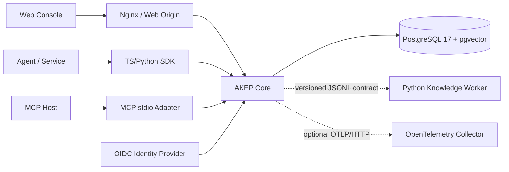
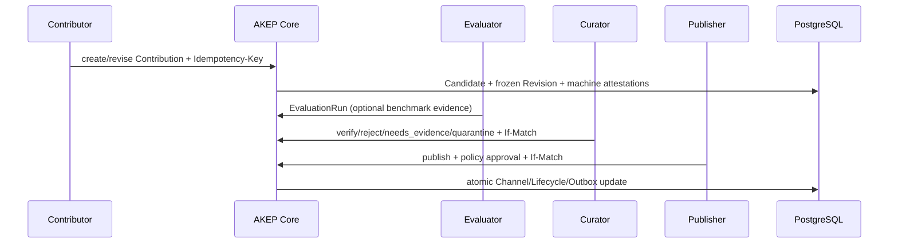

# 系统概览

- 状态：当前实现概览
- 最近核对：2026-07-17
- 适用版本：AKEP v0.1 实验实现

Agent Knowledge Platform 将知识视为“可验证、可治理、可演进的版本化资产”，而不是只把文档
切片写入向量库。平台围绕 Candidate → Evidence → Review → Publish → Query →
Usage/Feedback 建立闭环，并确保每次消费都能回到固定 Revision、Payload 摘要和内容范围。

## 1. 当前运行拓扑



默认 Compose 启动 Web、Core 和 PostgreSQL。MCP Adapter 是独立 stdio 进程；Python Worker
提供可独立验证的规范化、切片和静态扫描能力，但当前不在默认 Compose 中，也没有数据库权限。
生产 OIDC 签名固定 Tenant Principal、Query Space 前置过滤、固定部署 Tenant 的 PostgreSQL RLS
和 OTLP 导出已经有实现基线；控制面动态 Tenant、外部 PDP/完整策略下推、对象存储、异步 Worker
调度与 Outbox relay 仍未进入默认运行时。

外部接入、持续维护和多团队隔离的目标架构分别见：

- [外部系统接入设计](external-integration.md)
- [知识持续维护](../governance/knowledge-maintenance.md)
- [多团队隔离与受控共享](multi-team-isolation.md)

## 2. 组件与边界

| 组件 | 当前职责 | 明确不负责 |
| --- | --- | --- |
| Web Console | 展示真实 API 状态，驱动贡献、评测、审核、发布、检索和 Agent 接入 | 不作为授权或证明事实源 |
| AKEP Core | HTTP、认证、契约校验、治理状态机、事务、查询和收据 | 不执行 LLM 推理，不把知识正文当指令 |
| PostgreSQL | Revision/Lifecycle/Receipt/Outbox 的持久事实、可重建词法投影、17 张事实表 Tenant RLS、允许 Space 前置过滤 | 固定部署 Tenant 不代表共享多租户、外部 PDP 或大规模搜索已完成 |
| Knowledge Worker | 无状态内容规范化、确定性切片、静态敏感内容扫描、摘要校验 | 不直接读写数据库，不批准发布 |
| SDK | 封装版本头、错误、Query/ContextPack/读取及反馈闭环 | 不缓存第二套知识状态 |
| MCP Adapter | 将受治理查询、读取、Usage/Feedback 和候选贡献映射为 MCP 工具 | 不持有审核、发布、撤销或擦除权限 |
| OpenAPI / Schema | 固定 AKEP v0.1 wire contract 和互操作边界 | 不证明参考实现已启用所有协议操作 |

## 3. 核心身份模型

平台刻意分离三类身份：

- `recordId`：知识谱系的稳定逻辑 URI。
- `revisionId`：RFC 8785 JCS 规范化 Manifest 的 SHA-256 内容寻址 URI。
- `eventId`：一次贡献、决定或生命周期变化的事件身份。

`Revision` 不可原地覆盖；`Channel` 是某个 Space 对当前版本的可变采用指针。精确 Citation
同时固定 `spaceId + revisionId + payloadDigest + locator`，因此历史任务可以复现当时看到的内容，
而查询最新 Record Head 仍可得到后续版本。

## 4. 两条关键流程

### 4.1 知识成长



贡献成功只表示进入候选工作流，不表示已发布。Evaluator、Curator 与 Publisher 是不同职责；
紧急撤销和擦除还分别需要 `akep:incident` 与 `akep:erase`。

### 4.2 消费与效果证据

```mermaid
sequenceDiagram
    participant A as Agent
    participant API as AKEP Core
    participant DB as PostgreSQL

    A->>API: Query / ContextPack / fixed Revision read
    API->>DB: authorize before retrieval
    API-->>A: Citation + Exposure Receipt
    A->>API: Usage referencing issued exposure
    API-->>A: Usage Receipt
    A->>API: Feedback referencing real usage
    API->>DB: append evidence; never mutate content directly
```

Feedback 只形成证据，不能直接修改正文、排名规则或 Published Channel。撤销、擦除或策略水位
变化会使不再安全的旧曝光回执失效。

## 5. 数据与一致性

- PostgreSQL 保存不可变 Revision、生命周期事实、Contribution workflow、Attestation、
  EvaluationRun、Exposure/Usage/Feedback Receipt、Outbox 与查询投影。
- 迁移文件的名称和 SHA-256 会被记录并在启动时核对；生产数据库缺失迁移或迁移被修改时拒绝就绪。
- 17 张事实表以非空 Tenant、复合约束和 `ENABLE/FORCE RLS` 隔离；Core 专用连接池固定绑定部署
  Tenant，owner 管理数据库登录角色 → Tenant 绑定，生产运行角色必须与 migration owner 分离。
- OIDC Principal 的签名 Tenant 必须与部署 Tenant 一致；Query/ContextPack 将 Tenant、主体、
  Space、purpose、obligation 与策略水位编译为本地 AuthorizationPlan，Space 在 Published 元数据
  读取和 Passage SQL 排序/候选上限前过滤，游标绑定授权摘要。
- Channel/Status 变化和 Outbox 在同一事务内提交；发布唯一性由数据库约束保护。
- 当前 Payload 在 create/revise 同步路径中以内联 canonical base64 进入，单请求上限 10 MiB。
- pgvector 扩展和表结构已经就位，但当前检索只启用 lexical/exact；没有生产语义嵌入流水线。
- 对象存储、外部扫描隔离区、异步投影消费者和持久化跨实例 Policy Epoch 属于扩大部署前的工作。

## 6. 安全边界

所有知识正文、检索片段、模型输出、Agent 反馈和 Capability 描述都按不可信数据处理。当前核心
安全约束包括：

1. 生产环境禁止 development auth，并验证 OIDC issuer、audience、JWT `typ`、算法、最大寿命和
   与部署一致的签名 Tenant claim。
2. 授权在召回、读取和上下文组装前执行；Query Space 在元数据读取、排序和候选上限前过滤，
   用途、分类、策略和 obligation 在检索排序前继续复核。
3. Candidate 默认不可查询；贡献、审核、发布、事故响应和擦除职责分离。
4. Revision 与 Citation 使用摘要固定；写操作使用幂等键，工作流修改使用 ETag/`If-Match`。
5. 撤销和擦除先停止在线分发；当前试点回执不能冒充完整的监管级物理擦除证明。
6. 数据库 Tenant 条件与 RLS 双层执行；缺失或伪造 Tenant 上下文默认拒绝，production readiness
   校验角色绑定并拒绝 owner、superuser 与 `BYPASSRLS` 运行角色。

## 7. 运行形态

| 形态 | 数据 | 认证 | 用途 |
| --- | --- | --- | --- |
| 内存测试 | 进程内 Store | 测试身份 | 快速单元/契约测试，不用于共享环境 |
| 本地持久化 | PostgreSQL Compose | `dev-*` token | 开发、演示、完整成长闭环验证 |
| 单租户隔离试点 | 外部持久 PostgreSQL | OIDC Remote JWKS | 受控网络、可回滚试点 |
| 多租户/公网生产 | 尚未支持 | 尚未完成 | 需要控制面动态 Tenant、外部 PDP/完整策略下推、全链路对象/缓存/队列隔离、安全扫描和完整运维验收 |

## 8. 有意关闭

默认关闭 Federation、A2A Adapter、外部 Ingestion Connector、semantic/hybrid Query、自动晋级、
可执行能力包和通用多租户。详细原因和启用门槛见[实现状态](implementation-status.md)。

## 9. 下一步阅读

- 运行项目：[本地开发手册](../runbooks/local-development.md)
- 调用接口：[HTTP API 快速参考](../reference/http-api.md)
- 理解目标架构：[技术方案 v0.1](technical-design-v0.1.md)
- 理解协议：[AKEP v0.1](../protocols/akep-v0.1.md)
- 准备试点：[生产试点运行手册](../runbooks/production-pilot.md)
- 接入外部系统：[接入设计](external-integration.md)与
  [接入运行手册](../runbooks/external-system-onboarding.md)
- 运营知识：[持续维护设计](../governance/knowledge-maintenance.md)
- 规划团队隔离：[多团队隔离设计](multi-team-isolation.md)
