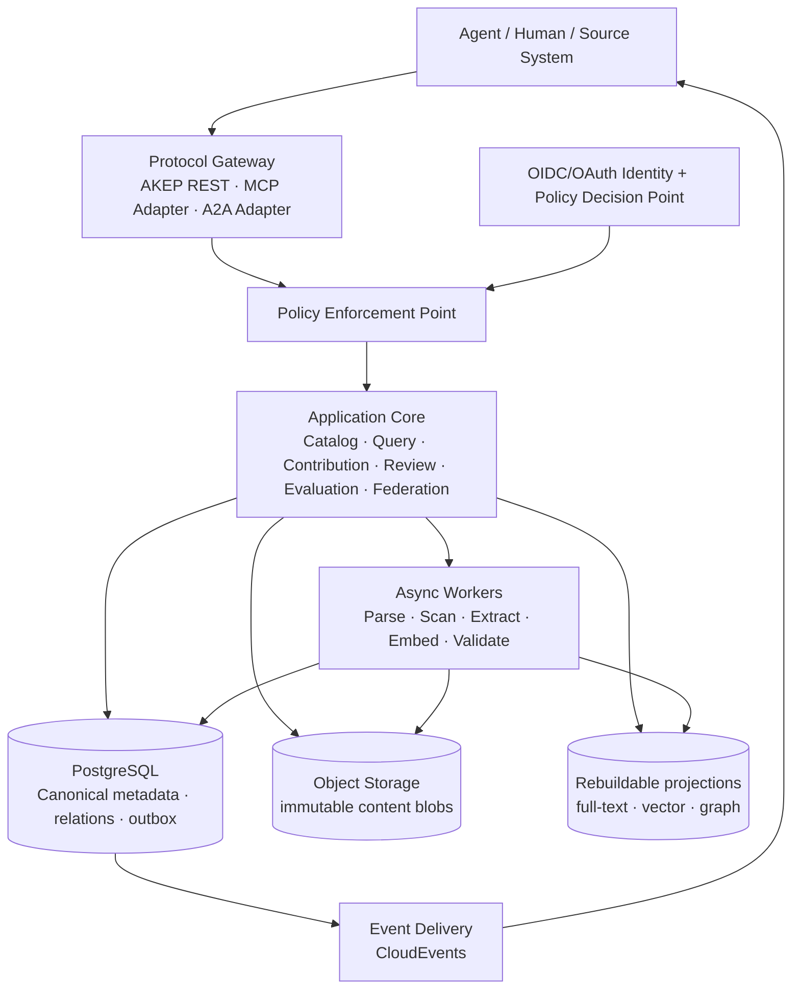
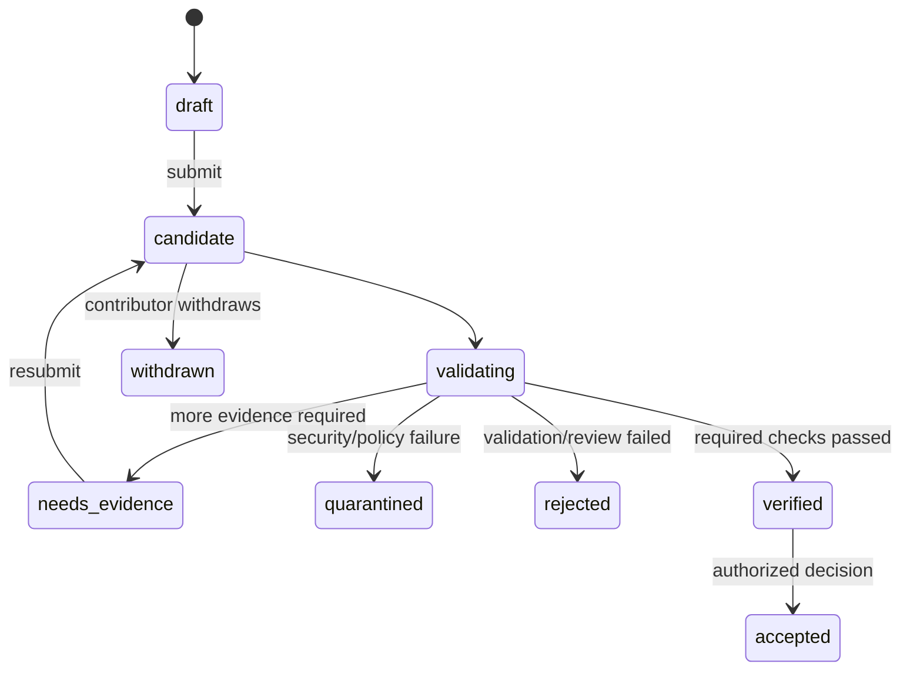

# Agent Knowledge Platform 技术方案 v0.1

- 状态：设计基线（Draft）
- 日期：2026-07-15
- 适用阶段：从 0 到 MVP，并为联邦化演进预留边界
- 配套协议：[AKEP v0.1](../protocols/akep-v0.1.md)

## 1. 结论先行

平台采用“协议优先、不可变资产、投影可重建、发布受治理”的架构：

1. 以 `Asset + immutable Revision Manifest + Evidence + Provenance + Policy + Attestation` 为知识事实源，而不是以文档切片或向量为事实源。
2. Agent 只能读取已授权版本、提交候选贡献和反馈；贡献默认不能直接进入正式知识面。
3. 可信度不是贡献者填写的单一分数，而是由来源、校验、时效、冲突和任务效果等可审计信号按场景计算。
4. MVP 使用模块化单体、异步 Worker、PostgreSQL、对象存储和事务 Outbox；全文、向量、图关系先作为 PostgreSQL 投影，达到明确阈值后再拆分。
5. 对外定义 AKEP（Agent Knowledge Exchange Protocol）；MCP 用于 Agent 访问知识工具和资源，A2A 用于 Agent 间任务协作，CloudEvents 用于事件，不重复发明这些层。
6. 从第一天保留全链路身份、租户、用途、密级、许可证和来源；联邦同步可晚做，但不能晚补这些字段。
7. 可执行能力与陈述性知识分层。Skill/Tool/Workflow 只以不可执行清单进入知识面，执行包走隔离的制品供应链和沙箱。

## 2. 目标、假设与非目标

### 2.1 目标

- 不同框架、模型和厂商的 Agent 能发现、检索、引用、贡献和评价知识。
- 每个可消费结论都能追到具体版本、来源、生成活动、策略与证据。
- 知识可以演进、分叉、冲突、废弃和撤销，而不覆盖历史。
- 通过线上使用证据与离线评测形成受控成长闭环，避免自我强化错误。
- 同一领域模型可在单实例、多租户和未来的跨组织联邦中复用。

### 2.2 当前默认假设

这些是假设，不是不可逆决策：

- 首个部署以私有或单组织环境为主，但数据模型按多租户设计。
- Phase 1 只支持固定 `source_document` 与 `procedure` Profile；断言、案例、失败经验和 `capability_manifest` 保留为后续 Profile，MVP 不接收、不索引、不执行。
- 中高风险知识必须有人类或被授权的治理主体批准；自动发布仅适用于低风险、可机器验证的限定类别。
- API 服务面向中等规模起步：百万级切片、千级并发以下。超过阈值再拆检索与事件基础设施。

### 2.3 非目标

- 不规定 Agent 内部记忆、推理链或编排框架。
- 不把模型输出自动等同为事实，也不保存或交换私有思维链。
- 不试图用一个全局分数定义“真相”。
- 不在 v0.1 解决开放互联网范围的全局信任、共识或去中心化身份。
- 不用 AKEP 替代 MCP、A2A、OAuth、CloudEvents 或 OpenTelemetry。

## 3. 架构不变量

以下约束应进入代码评审与合规测试：

1. **版本不可变**：已创建的 `Revision` Manifest、内容、来源和声明策略不可原地改写；修订必须生成新的内容寻址 Revision。
2. **引用可复现**：引用必须包含资产 ID、版本 ID、内容摘要和定位器；仅有逻辑资产 ID 不算稳定引用。
3. **派生可追踪**：摘要、翻译、抽取、合并和模型生成内容必须指向来源及生成活动。
4. **候选隔离**：Candidate 与 Published 使用不同的可见性域和索引分区。
5. **默认拒绝**：授权在检索前、上下文组装前、内容读取前和导出前均执行；过滤结果后补做授权不可接受。
6. **投影可丢弃**：Chunk、Embedding、全文索引和图索引均能从规范资产重建，不能成为唯一数据副本。
7. **策略随资产传播**：派生物默认继承来源中最严格的策略，只有有权主体可以显式降级。
8. **反馈只形成证据**：使用反馈不能直接修改内容或发布状态，必须经过聚合、反作弊和评测。
9. **撤销优先传播**：联邦节点必须优先处理撤销和权限收紧；缓存不能突破撤销边界。
10. **数据与代码分离**：知识正文永不因内容中的指令而获得工具权限；可执行资产必须经过独立验证和沙箱策略。

## 4. 逻辑架构



### 4.1 协议接入层

- **AKEP REST**：知识查询、精确读取、候选贡献、反馈、变更订阅和联邦交换的规范接口。
- **MCP Adapter**：把 AKEP 能力映射为 MCP resources/tools，供模型宿主使用；它是适配器而非事实源。
- **A2A Adapter**：把知识服务声明为 Agent 能力，把 AKEP 引用作为 A2A Artifact/DataPart 交换；A2A 负责任务，不承担批量知识同步。
- **SDK**：由 JSON Schema/OpenAPI 生成基础类型和客户端，再添加安全默认值、重试及引用辅助函数。

### 4.2 应用核心模块

| 模块 | 职责 | 关键边界 |
| --- | --- | --- |
| Catalog | Space、Asset、Version、Relation、Schema | 不负责模型推理 |
| Ingestion | 连接器、上传会话、解析任务、内容扫描 | 原始内容先进入隔离区 |
| Query | 混合检索、重排、策略过滤、上下文组装、引用 | 不更改规范知识 |
| Contribution | 候选提交、差异、证据绑定、幂等 | 不拥有发布权限 |
| Governance | 策略、审核、状态迁移、撤销、审计 | 所有发布走统一决策点 |
| Evaluation | 验证器、评测集、使用结果、质量证明 | 输出 Attestation，不原地改资产 |
| Federation | 能力发现、增量同步、收据、撤销传播 | 受双方策略和许可约束 |

MVP 将这些模块部署为一个进程内的清晰模块，异步工作由独立 Worker 处理。数据库所有权固定如下：Catalog 拥有 Tenant/Space 元数据、ProfileSchema、Record/Revision/BlobRef/Relation；Ingestion 拥有接入任务、上传状态和临时对象引用；Contribution 拥有 Contribution/workflow/idempotency；Governance 拥有 Channel/Status/PolicyBinding/PolicyEpoch/Decision/LifecycleEvent、发布审计事实和安全水位；Evaluation 拥有 Feedback/Evidence/Attestation/EvaluationRun；Query 拥有投影、Query/Read Exposure Receipt、Usage/Usage Receipt。每个写模块拥有自己的 Idempotency 与 Outbox 表。模块不得 ad-hoc 直接读写别人的表，只能调用进程内应用接口或消费版本化领域事件；Query 只读取自己的投影，并通过 Governance 接口读取当前 epoch/deny barrier。

三条写链采用明确边界：

- **Ingestion → Catalog → Contribution** 是可重试 Saga。Ingestion 先提交隔离对象和任务；扫描通过后调用 Catalog 的幂等 `CommitRevision`，只有 Blob 为 `verified/committed` 才提交 Revision；随后以 `ingestionId + revisionId` 唯一键调用 Contribution。任一步失败由 Outbox 重试，未引用对象回收；没有完整正文的 Revision 不能进入 verified/published。
- **Exposure → Usage → Feedback** 各自在所有者 schema 内提交 receipt + Outbox。Query 原子验证 Exposure 并生成 Usage；Evaluation 只通过 Usage 应用接口或 `UsageRecorded` 事件接收固定 Citation，禁止跨表拼接自报 ID。Feedback 的 `(subject, feedbackId, usageId)` 唯一且只形成 Evidence。
- **Review 与治理动作分离**。Review 事务只写 Contribution workflow/Review Decision/Attestation。Publish/Deprecate/Revoke/Erase 由窄事务协调器调用 Contribution 与 Governance 的命令，在同一 PostgreSQL 事务中写 workflow accepted、Decision、LifecycleEvent、Channel/Status、旧/新 policyEpoch、权威审计事实和 Outbox；模块仍负责本表约束，禁止任意跨 schema SQL。

任何下游投影失败都由 Outbox 重放修复。对于 revoke/erase，Governance 事务还同步写 deny/tombstone barrier；Query 若发现自己的 `appliedPolicyEpoch` 落后于 Governance 当前 epoch，必须 fail closed 或同步应用安全事件，不能在异步投影窗口继续服务。

Federation 与 A2A 在 Phase 1 只保留协议/适配器边界，不进入默认运行时。MCP Adapter 已作为
独立 stdio 进程接入 REST 最小闭环，但不拥有数据库、Revision 身份或发布权限。

### 4.3 控制面与数据面

- 控制面：身份、策略、Schema、连接器配置、发布规则、评测集、Peer 与密钥。
- 数据面：资产内容、查询、读取、贡献、投影和事件。
- 高敏环境可将两者部署在不同网络区；协议和领域模型保持相同。

## 5. 领域模型

### 5.1 核心实体

| 实体 | 含义 |
| --- | --- |
| `Tenant` | 安全与计费边界 |
| `Space` | 一组具有共同治理规则的知识命名空间 |
| `Asset` | 跨修订稳定的逻辑身份 |
| `Revision` | JCS 规范 Manifest 内容寻址的不可变知识版本；实现中也可称 AssetVersion |
| `ContentBlob` | 按摘要寻址的原始或派生字节 |
| `Claim` | 可验证或可冲突的最小陈述；并非所有资产都必须抽取 Claim |
| `Evidence` | 支持或反驳 Claim/Version 的来源引用 |
| `Activity` | 采集、解析、生成、翻译、审核或评测活动 |
| `Actor` | 人、Agent、服务或组织身份 |
| `Relation` | `derived_from`、`supports`、`contradicts`、`supersedes` 等有向关系 |
| `PolicyBinding` | 所有权、密级、用途、地域、许可证、保留期和义务 |
| `Attestation` | 验证、审核、签名、质量或安全扫描的独立证明 |
| `Contribution` | 创建、修订、废弃或撤销的候选变更 |
| `UsageRecord` | 某任务对具体引用的使用记录，经过隐私最小化 |
| `EvaluationRun` | 可复现评测及结果 |
| `Projection` | Chunk、Embedding、关键词和图关系等可重建读模型 |

### 5.2 资产类型

v0.1 使用小而稳定的上层分类，领域细类放在 Schema/标签中：

- `source_document`：原始或规范文档。
- `assertion`：可支持、反驳或过期的陈述。
- `observation`：在特定时间、条件下的观测。
- `procedure`：步骤、前置条件、输出和失败条件。
- `policy`：具有适用范围和优先级的规则。
- `example`：示例或成功案例。
- `failure_case`：失败、反例和修复经验。
- `hypothesis`：尚未充分验证的假设。
- `dataset`：数据集清单及访问引用。
- `prompt`：有版本和评测边界的提示资产。
- `capability_manifest`：Skill/Tool/Workflow 的不可执行清单；实际包由独立制品系统托管。

“事实”不是资产类型。一个 `assertion` 是否可作为事实使用，由证据、适用时间、评测与调用场景共同决定。

### 5.3 标识和版本

- `assetId / recordId`：跨修订稳定的 URI；可使用组织 HTTPS URI 或 `urn:akep:asset:<uuidv7>`。
- `revisionId`：`urn:akep:<algorithm>:<digest>`，对不含自身 ID、签名、状态和下载位置的 Manifest 做 RFC 8785 JCS 后计算；v0.1 必须支持 SHA-256。
- `revisionSequence`：单节点内便于排序的整数，不作为跨节点身份或真值裁决依据。
- `payloadDigest`：`<algorithm>:<hex>`，对 Payload 原始字节计算；v0.1 必须支持 `sha256`。
- Wire 协商使用 `major.minor`，规范/OpenAPI 发布物使用 SemVer，Manifest 使用独立 `manifestVersion`；知识 Revision 不使用 SemVer。能力包可另行使用 SemVer。
- 所有时间使用带时区的 RFC 3339 字符串，持久化统一为 UTC。

### 5.4 来源模型

来源模型与 W3C PROV 的最小概念对齐：

- Revision / ContentBlob → `prov:Entity`
- 解析、生成、评测、审核 → `prov:Activity`
- 人、Agent、组织、服务 → `prov:Agent`
- `derived_from`、`generated_by`、`attributed_to` 保留对应语义

内部不强制存 RDF；AKEP JSON 是规范交换格式，可按需提供 JSON-LD context、RDF/DCAT 目录投影，并以 SHACL 校验语义 Profile。远程 Context 必须用不可变 URI 和摘要固定，验证时禁止任意联网解析。生成活动至少记录 Actor、时间、工具/模型标识、输入 Revision 引用和 trace ID。Prompt 只保存摘要或获授权的版本引用，不能将密钥和私有上下文写入来源。

### 5.5 信任与质量

禁止将 `confidence: 0.93` 当作可移植真值。平台保存独立信号，再由 Space 的策略按用途计算决策：

- 来源等级与签名状态
- 独立证据数量、类型和新鲜度
- 结构/事实/安全验证结果
- 冲突数量与冲突方可信度
- 有效期和复审期
- 离线评测的提升、退化与置信区间
- 线上任务的帮助/伤害信号及样本量
- 风险等级与人工批准

质量/适用性评估输出 `suitable / suitable_with_warning / insufficient_evidence / unsuitable`，同时附原因和相关 Attestation；访问控制则独立输出 `allowed / allowed_with_obligations / denied`。两者不得混成一个分数。数值只用于同一策略版本内的排序，不承诺跨 Space 或跨节点可比。

## 6. 工作流、Channel 与安全状态

Contribution workflow 只描述一次候选提案的处理：



知识采用状态由另外两类对象表达：

- **Channel pointer**：每个 `Space + Trust Domain + Record` 有 `candidate / verified / published` 命名指针。
- **Revision Status overlay**：`deprecated / revoked / quarantined / erased` 是固定 Revision 上的追加声明；`revoked/erased` 具有单调安全优先级。

Draft 可以修改；提交时才冻结 Manifest 并产生 Revision。Contribution workflow、Channel 与 Status 均不写入不可变 Manifest。每次 Channel/Status 变化都追加带 Space、Actor、策略版本和理由的 LifecycleEvent，再更新可重建指针；状态变更使用乐观并发，客户端不能直接写当前值。

- 未被 Published Channel 指向的 Revision 不进入默认生产检索；Contribution 的 `candidate/validating/verified` 工作流状态本身不构成可检索资格。
- Deprecated 仍可复现历史，但新任务默认排除，显式请求时返回警告。
- Revoked/erased 立即停止正文分发并失效缓存与全部投影，只保留授权可见墓碑。
- Quarantined/rejected 不得洗掉历史；修复必须形成新 Contribution/Revision。

## 7. 关键流程

### 7.1 接入与发布

1. 接收内容到隔离对象区，计算摘要，记录上传者、来源和初始策略。
2. 执行格式校验、恶意文件扫描、敏感数据检测和许可证识别。
3. 在沙箱 Worker 中解析；保留原文，生成结构化派生版本和来源边。
4. 去重分三层：字节摘要、规范化内容、语义近似；语义近似只提示，不自动合并。
5. 生成 Chunk/Embedding/全文/图谱投影；投影记录算法、模型和参数指纹。
6. 运行领域校验和基准评测，输出 Attestation。
7. 治理模块依据风险和规则批准、驳回或要求更多证据。
8. 发布事件经事务 Outbox 发送，读模型幂等更新。

### 7.2 检索与上下文组装

1. 验证调用主体、委托链、租户、Space、用途和 token scope。
2. 取 Manifest 最低约束、本地追加式 `EffectivePolicyBinding` 与运行时规则的交集。PDP 先把固定策略编译为服务端保存、带参数且不可变的 backend predicate，再输出短时 `AuthorizationPlan(decisionId, policyEpoch, allowedVisibilityPartitions, backendPredicateHandle, backendPredicateDigest, expiry)`；Plan 不携带 SQL/DSL。该对象只在服务端内部传递，调用者不能提交、构造或扩大它。
3. 检索适配器必须在 `ORDER BY / ANN / LIMIT` 前应用允许分区、Published Channel 和 Chunk 级谓词，再做关键词、向量或结构召回；PostgreSQL RLS 作为第二道防线。
4. 合并和重排，加入时效、来源、冲突、质量策略与多样性信号。
5. 返回前对具体 Revision/Chunk 做 TOCTOU 策略复核，执行脱敏与义务附加。
6. 返回固定版本的引用、曝光回执、`policyEpoch`、摘要、定位器、分项分数、策略义务和索引新鲜度。
7. 上下文组装保持“数据”与“指令”边界，标记不可信内容，不执行知识中的命令。

检索授权必须发生在召回路径中。把全租户候选召回后再过滤，会通过计数、分数、时延或缓存泄漏不可见内容。MVP 只承诺可编译的 `tenant + Space + Group/Role + classification + purpose`；任意 ReBAC 若无法安全编译为分区/允许 ID 集就 fail closed。高敏租户或密级使用物理独立索引，而不是依赖统计侧信道无法证明的绝对等时响应。

Phase 1 不接受任意 Policy DSL 或任意领域 Profile。只启用机器固定的 [`mvp-access-policy`](../../specs/akep/v0.1/schemas/mvp-access-policy.schema.json)、[`source_document`](../../specs/akep/v0.1/profiles/mvp-source-document-v1.json) 与 [`procedure`](../../specs/akep/v0.1/profiles/mvp-procedure-v1.json)：

- Access 规则固定 `default deny + deny-overrides`；主体只使用本地映射后的 Group/Role set，资源只使用 tenant/Space/classification，调用上下文只使用 purpose。缺字段、未知主体集、`restricted`、未知 obligation 或编译失败一律 deny。
- classification 顺序固定为 `public < internal < confidential`；`restricted` 明确不进入 MVP。请求过滤只能收窄，不能产生 allow。
- Phase 1 `policyEpoch` 是 tenant-wide 单调安全 epoch：任一影响访问/强制门禁的变更使全租户递增。跨多个 Space 的 Query 因此只需绑定一个 epoch；这是保守失效策略，后续若分片必须用显式 epoch map 新版本，不能改变 v0.1 字段含义。
- PDP 输出必须满足 [`authorization-plan.schema.json`](../../specs/akep/v0.1/schemas/authorization-plan.schema.json)，绑定 subject digest、tenant、Space、purpose、policyEpoch、允许分区、opaque 谓词句柄、谓词摘要、义务与短时有效期。句柄只引用同一信任边界内由策略编译器保存的参数化 AST/预编译计划；检索适配器 dereference 时必须重新核对主体、tenant、Space、purpose、epoch、expiry 和 digest，任何缺失/不一致都 deny。不得在该对象中传 SQL/任意 Policy DSL，Query 也不接受调用者提交 Plan。
- 只有上述两个 Profile 的精确 URI + digest 可进入 Phase 1；其他 `assetType/profile` 返回 422，不做“尽力理解”。Profile、Policy 和编译器版本变化都触发新 digest、policyEpoch 与契约回归。
- 固定治理 floor 只接受 `LicenseRef-Company-Internal`、`jurisdiction=CN`、同许可证派生与 `export=deny`；未知许可证/地域、跨许可证派生或保留/删除冲突一律拒绝。正文按 Owner 明示期限或批准的 erase 流程处理，Telemetry/Feedback 默认假名化保留 30 天；Phase 1 不做跨域导出或 Federation。

### 7.3 Agent 贡献

1. Agent 基于读取到的固定版本提交 `create/revise/deprecate/revoke` 候选，带理由、证据、基础版本和幂等键。
2. 平台校验基础版本和策略；冲突时保留分支，不做 last-write-wins。
3. 新候选进入与正式索引隔离的工作流。
4. 验证与审核产生独立证明；只有治理模块可以发布。
5. 发布后通知贡献者，保留从原任务、使用记录到新版本的来源链。

### 7.4 成长闭环

1. Query/Read 先生成绑定主体、Space、purpose、Citation 与 `policyEpoch` 的曝光回执。
2. Agent 明确提交实际采用的 Citation，平台校验曝光回执后生成 `usageId`；只记录任务类型、引用、策略版本和必要结果，不默认记录完整用户提示。
3. Agent 或评测器提交 `helped / neutral / harmed / unknown`，服务端只接受与 Usage Receipt 匹配的反馈，可带指标和证据。
4. 聚合服务按主体、任务和时间做去重、反作弊与隐私阈值处理。
5. 候选知识先做离线回放和对照评测；只有经过治理批准并形成新 ranker/profile 版本的结果才可上线。
6. 发现退化、过期或伤害时触发复审；高危内容可紧急撤销。

生产 Feedback 本身只形成 Evidence 或触发复审，不能直接修改在线排序、发布状态、训练集或知识正文；排序变化必须经过聚合、独立离线评测、治理批准和版本化部署。

### 7.5 联邦共享

共享单位是“授权后的资产清单 + 内容/引用 + 来源 + 策略 + 证明”，不是裸向量：

1. 节点通过 AKEP discovery 协商版本、Profile、认证、事件和扩展。
2. 接收方按双方策略选择 `metadata_only / reference_only / copy` 模式。
3. 增量同步使用对 Peer 和策略范围不透明的 cursor，按至少一次投递处理。
4. 接收方重新计算 Manifest 的 `revisionId`，用 `recordId + revisionId` 幂等落库并保留远端来源，不冒充本地产物。
5. 冲突版本并存，通过 `supports/contradicts/supersedes` 表达；本地策略决定默认使用哪一支。
6. 撤销、权限收紧和密钥失效事件优先级高于普通更新；无法继续授权时必须清除正文和派生投影。

## 8. 数据与存储方案

### 8.1 MVP 选型

| 能力 | 默认实现 | 原因与退出条件 |
| --- | --- | --- |
| 规范元数据 | PostgreSQL | 事务、约束、JSONB、RLS、成熟运维；按租户/时间分区 |
| 内容 | S3 兼容对象存储 | 租户独立前缀/密钥、版本与生命周期；知识正文不默认 WORM，本地可用 MinIO |
| 全文 | PostgreSQL FTS | 降低初期复杂度；相关性/吞吐不达标再接 OpenSearch |
| 向量 | pgvector | 与授权元数据近邻；规模或召回延迟越界再换专用引擎 |
| 图关系 | PostgreSQL edge table + recursive CTE | 来源/冲突图先够用；复杂多跳分析明确后再投影到图数据库 |
| 异步任务 | PostgreSQL job queue + transactional outbox | 保证提交与事件原子；跨团队高吞吐后接 Kafka/NATS |
| 缓存 | 可选 Redis | 只缓存授权后结果；键必须含 tenant、授权等价类/subject、Space、purpose、policyEpoch、规范请求摘要和 projection generation |
| 策略 | 独立 PDP 接口，初始可用 OPA | 业务不绑定策略 DSL；决策日志写审计流 |
| 可观测性 | OpenTelemetry | 统一 trace、metric、log，传播 W3C Trace Context |

### 8.2 事实源与投影

`Revision` 和 ContentBlob 是规范事实源。每个投影键至少包含：

```
(tenant_id, revision_id, visibility_partition,
 parser_fingerprint, chunker_fingerprint,
 embedding_model_fingerprint, projection_schema_version)
```

`visibility_partition` 是由版本化本地 PolicyBinding 编译的安全等价类，至少包含 Space、Group/Role、classification 和 purpose，不是客户端字段，也不按每个用户复制向量。PolicyBinding/Channel、revoked/quarantined/erased、强制 Attestation 失效/过期以及访问相关身份/Group 变化都必须递增 `policyEpoch`。安全事件先在同一事务写 deny/tombstone barrier 并使旧 snapshot/receipt/cache fail closed，再异步重算分区；高敏域使用物理隔离。

任何模型、切分或策略变化都生成新投影代次；切换完成前双读或影子评测，不能静默覆盖。API 返回 `projectionGeneration`、`indexedThrough` 和 `policyEpoch` 以暴露新鲜度。

### 8.3 一致性

- 规范元数据与 Outbox：强一致事务。
- 对象上传：存储键至少为 `(tenant_id, digest)`，状态为 `temporary → verified → committed → deleting/deleted`；摘要/size 校验与 finalize 幂等，引用计数和孤儿回收处理 DB/对象存储部分失败，禁止跨租户内容去重探测。
- 搜索投影：最终一致；精确读取可在发布后立即可用。
- 发布响应返回事件位置；调用者可用 `minCheckpoint` 请求读己之写。
- 联邦同步：至少一次、顺序不保证；消费者按版本、摘要和事件 ID 幂等。

### 8.4 备份恢复与安全水位

Revision 元数据、LifecycleEvent 和普通备份不能是撤销的唯一副本。Governance 使用独立故障域的追加式安全日志保存所有提高安全水位的动作（至少包括 revoke/erase、deny/tombstone 与新 PolicyEpoch）；这里可使用明确保留期的对象锁/WORM，但不保存知识正文。Outbox/消息 broker 只能做派生投递，不能作为该日志的唯一写路径。

安全动作采用 log-first、保守恢复的三步协议：

1. Governance 以幂等 `safetyActionId` 同步追加签名 `SafetyBarrierIntent`，固定 Space/Revision、动作、decision digest、旧/新 epoch 和新 watermark；独立日志持久化 ACK 前不得开始数据库提交，日志不可达返回 503 且不改变治理状态。
2. 数据库事务核对 Intent ACK，在同一事务写 deny/tombstone、PolicyEpoch、Decision/LifecycleEvent、审计事实和 Outbox。数据库提交失败时 Intent 保留为保守 deny，等待有权人工/自动对账，不能被恢复流程忽略。
3. 数据库提交后同步追加 `SafetyBarrierCommit`，绑定 action ID、数据库事务标识和 committed watermark。Commit 不可达时安全动作在数据库中仍立即生效，但 API 不返回成功；幂等重试只补 Commit 并返回原 receipt，不回滚 barrier。只有 Commit 已持久化才可确认成功。

恢复端把未配对 Intent 也视为 deny，直到对账完成，因此故障最多造成保守不可用，不能复活已撤销内容。日志记录按 action ID 哈希链接或由等价防篡改机制保护；独立 writer、WORM 保留策略、告警和定期恢复演练属于生产必选项。

任何数据库/对象恢复实例默认处于 sealed 状态，不接收 Query/Read。恢复流程必须先验证备份、从安全日志/WAL 重放到控制面最新水位、恢复 deny/tombstone、处理擦除密钥/保留策略并重建或净化投影；只有 `appliedSafetyWatermark >= requiredSafetyWatermark` 后 readiness 才可开放。无法取得最新水位时 fail closed，不能用旧备份提供降级读服务。

## 9. 安全与治理

### 9.1 身份和授权

- 人类登录用 OIDC；Agent/服务用 OAuth client credentials、workload identity 或 mTLS，遵循 OAuth 安全最佳实践。
- token 同时绑定 `subject`、租户、允许操作和可验证的委托关系；客户端提交的 `tenantId/purpose` 不能单独成为授权依据。
- 采用 RBAC 提供粗粒度角色，受限 ABAC 决定 Space、资产、用途、地域和义务；通用 ReBAC 暂不进入 MVP 承诺。
- `akep:query/read/contribute/feedback/review/publish/incident/erase/federate/admin` 分离 scope；`publish`、`incident`、`erase` 互不包含，Agent 默认不持有后三者。
- 高风险动作支持双人批准、短时凭证和不可抵赖审计。

### 9.2 主要威胁控制

| 威胁 | 必须控制 |
| --- | --- |
| 知识投毒 | 候选隔离、来源链、独立验证、贡献配额、异常检测、可撤销 |
| 间接提示注入 | 内容视为不可信数据、结构化边界、指令降权、工具最小权限、沙箱 |
| 越权检索与向量泄漏 | 授权分区召回、Chunk 级复核、无跨策略缓存、禁止未授权计数/分数侧信道 |
| 恶意文件/解析器 | 隔离上传、类型嗅探、杀毒、资源限制、无网络沙箱、依赖加固 |
| 恶意能力包 | 清单与执行包分离、签名/SBOM/扫描、显式批准、隔离运行、出站网络策略 |
| 反馈操纵 | 身份绑定、采样门槛、去重、反作弊、离线对照、不可直接发布 |
| 联邦重放/篡改 | TLS、受众限制、幂等事件 ID、时间窗口、摘要链、必选 DSSE+JCS+Ed25519，其他 proof suite 才是扩展 |
| 删除或授权收紧未传播 | 撤销墓碑、优先通道、短缓存 TTL、定期对账、派生投影清除 |
| 模型与敏感信息泄漏 | 最小化日志、Prompt 摘要、字段级加密、DLP、留存策略、导出审计 |

### 9.3 策略传播

派生资产的有效策略是所有输入策略与本地规则的交集。若许可证、地域或用途不兼容，生成活动失败并留下审计事件。摘要和 Embedding 仍视为原内容的受控派生物，不能因为“不可直接阅读”而绕过删除、地域或密级策略。

### 9.4 隐私

- Usage 默认不存原始任务文本、完整对话或用户标识；需要时使用单独许可和保留期。
- 评测数据与生产内容分区，敏感字段令牌化或加密。
- 对外联邦前执行最小披露；支持仅共享清单、远程引用或经过批准的派生摘要。
- 删除请求同时处理规范内容、对象版本、缓存、搜索/向量/图投影、备份生命周期与远端通知。

## 10. 能力资产供应链

本节属于 Phase 2+ 设计，不是 MVP 实现范围。启用前必须先发布独立 `capability_manifest` Payload Schema 和执行回执 Schema；否则 Node 不得在 discovery 中声明能力 Profile，也不得接受该 `assetType`。

可执行能力的风险显著高于知识文本，采用两层模型：

1. AKEP 中的 `capability_manifest` 描述名称、输入输出 Schema、权限、运行时、版本、评测、制品摘要和来源；它本身不可执行。
2. 实际 Skill/Tool/Workflow 包使用 OCI Artifact 或等价制品分发，绑定不可变 digest、SBOM、签名和安全 Attestation。
3. 安装与执行是显式治理动作，不由 `knowledge.read` 自动触发。
4. 运行时使用沙箱、只读文件系统、最小密钥、CPU/内存/时间限制和默认拒绝出站网络。
5. 能力的任务效果、失败和安全事件回写为独立证据；更新产生新制品和新 Revision。

## 11. API 与协议边界

AKEP v0.1 定义五个 Profile：

- `reader`：发现、查询、精确读取、引用。
- `contributor`：提交候选与使用反馈。
- `curator`：验证与审核 Contribution workflow，不能发布或改变安全状态。
- `publisher`：独立 publication/safety API；publish、incident revoke 和 privacy erase 仍使用互不包含的细粒度 scope/PDP。
- `federation`：跨节点清单、内容、变更和撤销交换。

最小 MVP 对 Agent 实现 `reader + contributor`；管理 UI 内部实现 curator/publisher，但必须保持 review、publish、incident 和 erase 分权；`federation` 在单节点闭环验证后开启。

协议细节、错误、幂等、并发、事件和适配规则见 [AKEP v0.1](../protocols/akep-v0.1.md)。机器可读 Schema 位于 [`specs/akep/v0.1`](../../specs/akep/v0.1/)。

## 12. 可观测性与评测

### 12.1 追踪

所有入口接受和传播 W3C Trace Context。关键 Span：

- `akep.query`
- `akep.policy.evaluate`
- `akep.retrieve.lexical/vector/graph`
- `akep.rerank`
- `akep.asset.read`
- `akep.contribution.submit`
- `akep.validation.run`
- `akep.publication.decide`
- `akep.federation.sync`

Span 只记录不敏感的 ID、版本、计数、耗时和策略结果；正文、Prompt、token 和 PII 默认禁止进入 telemetry。

### 12.2 核心指标

- 检索：Recall@K、nDCG、引用覆盖率、无答案准确率、授权过滤率、P95/P99。
- 知识：有来源版本占比、过期率、冲突未处理时长、撤销传播延迟。
- 闭环：贡献接受率、从候选到发布时长、评测提升/退化、伤害反馈率。
- 治理：越权拒绝、策略错误、隔离命中、人工复审积压。
- 成本：每次查询的模型/检索成本、每版本投影成本、无效重复率。

### 12.3 发布门禁

每类 Space 配置不同门禁。建议最低包括：Schema 通过、无阻断级安全问题、来源完整、许可证兼容、关键评测不退化、冲突已标明、高风险内容有人类批准。自动发布必须限定类型、来源和影响范围，并保留一键撤销。

## 13. 部署形态

### 13.1 本地开发

- API/Worker 单仓库，容器化运行。
- PostgreSQL + pgvector、MinIO，可选本地 OIDC/PDP。
- 固定种子的契约测试和小型评测集。

### 13.2 生产起步

- API 与 Worker 独立扩缩容，PostgreSQL 高可用，对象存储开启版本和加密。
- Ingestion Worker 在隔离节点池运行。
- 私网访问数据库和对象存储，所有服务使用工作负载身份。
- Outbox relay 至 CloudEvents webhook/消息基础设施。
- 独立账号/项目部署同步 Safety Log writer 与对象锁/WORM 存储；Governance 到 writer 使用工作负载身份和双向认证，writer 不与 PostgreSQL/普通备份共享故障域。

### 13.3 拆分触发器

不按组织图预拆微服务。满足下列任一条件才拆：

- 模块需要独立安全边界或数据驻留。
- 负载/扩缩容曲线显著不同且已成为瓶颈。
- 独立发布频率与所有权已经稳定。
- PostgreSQL 投影不能满足经过测量的容量或延迟目标。

## 14. 分阶段路线

### Phase 0：契约与风险样本（1–2 周）

- 固化 AKEP v0.1、JSON Schema、状态机、策略矩阵和 20–50 条黄金评测任务。
- 建立威胁样本：注入、投毒、越权、过期、冲突、撤销和反馈操纵。
- 用两个不同框架的假 Agent 做契约走查，不写复杂 UI。

退出标准：同一资产能经 Ingestion/Contribution、验证、发布、Query、Usage、Feedback 和撤销闭环；两种客户端通过同一契约；正/负测试向量覆盖摘要错误、重复键、unknown critical、分叉、伪造 Usage 和撤销重放；每步有审计证据。

### Phase 1：单节点最小闭环（6–8 周）

- 文档上传/解析、不可变 Revision、候选区、人工审核。
- REST text/hybrid Query、固定 Citation、AKEP reader/contributor。
- Exposure → Usage → Feedback、最小离线评测、可编译授权分区、OpenTelemetry。
- REST 闭环通过后以独立进程提供只读优先的 MCP Adapter；不实现 Federation、A2A、能力包、通用 ReBAC 或 raw vector API。

暂定退出标准（业务 Owner 在 Phase 0 结束前确认）：

- 至少 100 份代表文档、50 条黄金任务；声明支持的格式解析成功率 ≥ 95%，失败可重试且不产生 Published 半成品。
- Recall@5 ≥ 0.85、无答案精确率 ≥ 0.90；新知识版本不得让关键安全/正确性指标显著退化。
- 100% Citation 能重新定位到相同 Revision、Payload digest 和字节范围。
- Candidate、Revoked 和未授权内容在安全测试中返回结果数为 0；统一 403/404 与统计侧信道测试通过。
- revoke/erase 或权限收紧事务提交后，deny/tombstone 与新 policyEpoch 必须立即让精确读取、Query、旧 snapshot/receipt/cache fail closed；物理缓存删除和投影净化 P99 ≤ 60 秒，不允许在该窗口继续分发。
- 伪造/跨主体 Usage 全部拒绝，重复 Usage/Feedback 幂等。
- 在 100 万 Chunk、20 QPS 的基准条件下，纯检索 Query P95 ≤ 800 ms（不含外部 LLM）。
- 对象成功但 DB 失败、DB 成功但投影失败、重复 finalize、删除后备份恢复等故障注入不能产生“已发布但无正文”或复活撤销内容。

### Phase 2：治理与多租户（4–8 周）

- 从 Phase 1 的固定单组织 ABAC/许可证/Attestation 基线扩展到多租户策略、通用可编译 ReBAC、复杂留存/地域映射和跨域质量 Attestation。
- 连接器、增量接入、重复检测、自动复审队列。
- 能力清单和隔离制品验证，但默认不自动安装。

退出标准：租户隔离和策略传播通过安全测试；可恢复演练和审计查询达标。

### Phase 3：受控联邦（6–10 周）

- AKEP federation、Peer 策略、增量 cursor、墓碑、对账和必选 DSSE+JCS+Ed25519 事件链；其他 proof suite 作为扩展。
- 先在两个受控节点间灰度，只共享低风险 Space。
- 增加 A2A 能力描述和跨 Agent 任务场景。

退出标准：断网重试、乱序、重复、冲突、权限收紧和撤销传播测试全部通过。

## 15. Phase 1 决策门

这些问题不阻塞 Phase 0，但必须由对应 Owner 在 Phase 1 开工前签字；没有答案时使用表中保守默认值：

| 决策 | Owner | 截止里程碑 | 保守默认 |
| --- | --- | --- | --- |
| 首个用户、唯一主场景、任务成功定义 | Product Owner | Phase 0 第 1 周 | 内部中文客服政策问答 |
| 部署形态 | Platform Owner + Security | Phase 0 结束 | 单组织私有部署，逻辑保留 tenant 字段 |
| 文件格式、语言、大小、OCR/失败策略 | Knowledge Owner | Phase 0 结束 | PDF/Markdown/HTML，zh-CN，10 MiB，OCR 人工开关 |
| Phase 1 Profile 与 Access Policy | Knowledge + Security Owner | Phase 0 结束 | 只启用仓库固定的 source_document/procedure + mvp-access-policy；其他 422 |
| 身份源、Group 映射、purpose 词表、最高密级 | Security Owner | Phase 0 结束 | OIDC，Group+Space ABAC，最高 confidential；restricted 不入 MVP |
| 中文检索/Chunk/Embedding 基线 | Search + Evaluation Owner | Phase 0 基准完成 | 版本化应用侧中文分词；800 Unicode code point/100 overlap Chunk；Embedding 制品/参数/硬件以 digest 固定，不选定前只开放 lexical、不得声称 hybrid 达标；首版无在线 reranker |
| 规模、QPS、P95 与成本上限 | Platform Owner | Phase 0 基准完成 | 100 万 Chunk、20 QPS、P95 800 ms |
| Reviewer/Owner/Incident Responder 与 SLA | Governance Owner | 首次导入前 | R1 一审，R2 双角色；紧急撤销 15 分钟内响应 |
| Feedback 的真实结果来源与隐私留存 | Product + Privacy Owner | Usage API 冻结前 | 仅明确任务结果，原始 Prompt 不存，假名化保留 30 天 |
| 自动发布边界 | Governance Owner | 首次发布前 | 全部关闭 |
| 能力包范围 | Security + Product Owner | Phase 1 开工前 | 完全不做，只保留未来类型标识 |
| 项目/协议许可证与公共命名空间 | Legal + Maintainer | 对外发布前 | 未选择许可证，不对外声称标准或 conformance |

## 16. 标准复用边界

| 标准 | 本方案中的用途 | 不承担的职责 |
| --- | --- | --- |
| MCP 2025-11-25 | Agent/模型宿主访问知识 resources/tools | Agent 间任务、知识治理和联邦复制 |
| A2A 1.0 | Agent 发现、协作任务、Artifact 交换 | 工具调用、规范知识版本和批量同步 |
| CloudEvents | 跨进程/节点事件信封 | 资产正文模型和查询 API |
| W3C PROV-O | 来源语义映射 | 强制内部使用 RDF |
| JSON-LD 1.1 / RDF 1.1 / SHACL 1.0 / DCAT 3 | 可选语义互操作、校验和目录投影 | v0.1 核心 JSON 解析要求 |
| OpenTelemetry | Trace/Metric/Log 与上下文传播 | 业务审计事实源 |
| OAuth/OIDC | 身份和 API 授权 | 资产级策略本身 |
| W3C VC 2.0 | 可选组织、Agent 或审核资质证明 | 每条知识的强制包装 |
| OCI Artifact / in-toto | 可执行能力制品与供应链证明 | 普通知识检索协议 |

参考资料：

- [Model Context Protocol specification](https://modelcontextprotocol.io/specification/2025-11-25)
- [A2A Protocol 1.0.0 specification](https://a2a-protocol.org/v1.0.0/specification/)
- [CloudEvents](https://cloudevents.io/)
- [W3C PROV-O](https://www.w3.org/TR/prov-o/)
- [JSON-LD 1.1](https://www.w3.org/TR/json-ld/)
- [RDF 1.1 Concepts](https://www.w3.org/TR/rdf11-concepts/)
- [SHACL 1.0](https://www.w3.org/TR/shacl/)
- [DCAT 3](https://www.w3.org/TR/vocab-dcat-3/)
- [OpenTelemetry specification](https://opentelemetry.io/docs/specs/otel/)
- [OAuth 2.0 Security Best Current Practice, RFC 9700](https://www.rfc-editor.org/info/rfc9700/)
- [W3C Verifiable Credentials Data Model 2.0](https://www.w3.org/TR/vc-data-model/)
- [OCI Distribution Specification](https://specs.opencontainers.org/distribution-spec/)
- [in-toto Attestation Framework v1.2.0](https://github.com/in-toto/attestation/tree/v1.2.0/spec)
