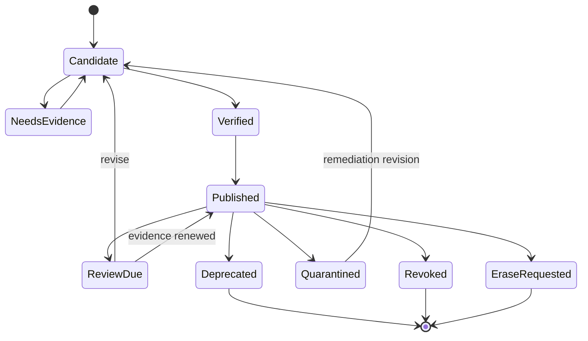
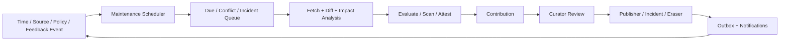

# 知识持续维护与质量运营设计

- 状态：目标设计；部分证据和生命周期能力已实现
- 最近核对：2026-07-17
- 关联文档：[信任与发布治理](trust-and-publication.md)、
  [外部系统接入](../architecture/external-integration.md)、
  [多团队隔离](../architecture/multi-team-isolation.md)

持续维护的目标不是定期“重新向量化”，而是让每个 Published Revision 始终有明确 Owner、来源
水位、有效期、质量证据、使用效果和退出路径。维护动作产生新的证据、Contribution 或
LifecycleEvent，不能原地修改 Revision。

> [!NOTE]
> 当前实现已有 `reviewAfter` 校验、不可变 Revision、Attestation/EvaluationRun、Usage/Feedback、
> deprecate/revoke/erase 和事务 Outbox；但没有 Connector checkpoint、维护调度器、Owner 目录、
> 通知/SLA、冲突/来源变化队列和 Outbox relay。本设计明确这些目标能力。

## 1. 维护对象与责任

每个 Record/Space adoption 必须有：

| 字段 | 说明 |
| --- | --- |
| `businessOwner` | 对语义正确性和业务适用性负责 |
| `stewardTeam` | 日常整理、来源映射和复审队列 |
| `technicalOwner` | Connector、映射器、任务和数据质量 |
| `securityPrivacyOwner` | 密级、用途、保留、扫描和事件响应 |
| `sourceRefs` | 权威来源及其独立性/优先级 |
| `maintenancePolicyRef` | 风险、时效、证据、复审和退出规则 |
| `reviewAfter` | 下一次强制复审/失效边界 |
| `fallbackBehavior` | warning、no-answer、fail-closed 或升级人工 |

没有 Owner 的知识不能长期保持 Published。Owner 离职、团队撤销或 Source Contract 失效会创建
高优先级维护任务；超过接管 SLA 的资产降级、隔离或 fail closed，不能成为无人负责的“永久知识”。

Manifest `policy.owners` 使用稳定的团队/组织 URI，并进入不可变 Revision；具体人员、值班表、
通知地址和代理关系保存在可变的 Owner Directory。人员轮换只更新 Directory，不重写知识。
责任组织真正变化时，通过新 Revision 或经治理的本地 PolicyBinding 变更表达，不能原地修改 Manifest。

## 2. 生命周期



`ReviewDue` 是维护队列状态，不进入不可变 Manifest；它由 `reviewAfter`、Attestation expiry、
来源变化、冲突和策略事件计算。Procedure 到期按现有语义 fail closed，必须通过新 Revision 重新发布；
低风险 Source Document 可按 Policy 选择 warning + 降权，但不能超越许可证/访问/安全硬门禁。

## 3. 触发器

### 3.1 时间触发

- `reviewAfter - warningWindow`：通知 Owner，创建可合并任务。
- `reviewAfter - escalationWindow`：升级 Steward/Governance，暂停自动共享/派生。
- `reviewAfter`：按 Profile/风险执行 fail closed、warning 或 quarantine。
- Attestation/许可证/合同/密钥/来源凭据到期：重新判定发布门禁。
- 长期零使用不是“错误”，但可进入归档成本评审；不能因此自动 erase。

### 3.2 来源触发

- Connector source version/digest 变化：生成 diff 和 revise Candidate。
- 来源权限/分类收紧：先立即停止不再授权的分发，再异步复审。
- 来源删除：默认 deprecate 候选；法律/隐私决定才进入 erase。
- 来源更名/移动：更新外部定位映射，不因 URI 变化制造新 Record。
- 多个来源出现矛盾：创建 `contradicts` 关系和冲突任务，不静默覆盖。
- Mapping/Parser/Chunker 版本变化：区分规范 Revision 与可重建投影；只重建投影时不改 Revision。

### 3.3 证据与使用触发

- Required Attestation 过期/撤销/输入 Revision 撤销：立即重新判定。
- `harmed` Feedback、异常失败率或安全发现：可先 quarantine/revoke，正向反馈不能自动晋级。
- 评测集/策略版本变化：批量 re-evaluate，结果作为新 Attestation，不修改旧证明。
- 下游依赖的源 Revision 撤销：沿 provenance/relations 生成影响分析和复审队列。
- Citation 定位失败、Blob digest 不匹配或恢复后安全水位倒退：安全事件，不是普通数据错误。

## 4. 风险与维护策略

下面是起始模板，最终 SLA 由 Space Owner 与安全/合规 Owner 签字：

| 风险 | 示例 | reviewAfter 上限 | 到期行为 | 维护响应 |
| --- | --- | --- | --- | --- |
| R0 | 公开术语/目录元数据 | 180 天 | warning/降权 | 30 天内 |
| R1 | 一般文档/示例 | 90 天 | warning 或隐藏 | 14 天内 |
| R2 | 业务政策/操作流程/Prompt | 30 天 | fail closed | 3 个工作日 |
| R3 | 法律/财务/医疗/安全/权限 | 7–30 天 | fail closed + 人工升级 | 4–24 小时 |

这是默认上限而非“建议所有知识按周期重发”。若权威来源能提供签名变更事件，仍保留最长复审边界，
但日常由事件驱动；无法检测变化的来源采用更短周期。高风险紧急负面证据不等待 reviewAfter。

Maintenance Policy 至少声明：

- Profile/assetType/risk 与适用 Space。
- warning/escalation/expiry 窗口和到期行为。
- requiredAttestations、方法版本、最大年龄和独立 Reviewer 数。
- 来源优先级、最小独立来源、许可证/地域/用途规则。
- 最低离线评测、无答案/安全阈值和退化容忍度。
- harmed/冲突/权限收紧阈值以及 quarantine/revoke 路径。
- Owner 接管、归档、deprecate、erase 和备份保留规则。

## 5. 维护流水线



### 5.1 Scheduler

- 从持久化 `nextReviewAt`、Attestation expiry、Connector event 和 Outbox 建任务。
- 任务键为 `tenant + space + record + triggerType + triggerVersion`，至少一次执行、幂等。
- 使用租户化租约/`FOR UPDATE SKIP LOCKED`；Worker crash 后可安全重领。
- 安全触发器优先于普通 freshness，按 Tenant 配额隔离 noisy neighbor。
- 调度延迟和队列年龄有 SLO；内存 timer 不能成为事实源。

### 5.2 Diff 与影响分析

Diff 分四层：

1. 原始来源字节/版本/digest。
2. 规范 Manifest 字段与 Payload。
3. 语义结构（段落、procedure steps、policy clauses）。
4. 依赖影响（派生 Revision、Published Space、Citation、Agent workflow）。

自动摘要只能辅助 Reviewer，不能替代固定来源 diff。对大规模变更先 dry-run，报告新增/修改/删除、
策略变化、预计 Revision 数和受影响下游，再由 Owner 批准批次。

### 5.3 评测和发布

- 评测输入固定 dataset/evaluator/method digest；同一 Revision 的结果不可变。
- 来源同步成功不等于新 Revision 质量通过。
- 低风险白名单可自动创建 Candidate/Attestation；自动 publish 默认关闭。
- R2/R3 需要独立 Curator/Publisher，作者/Connector 不能自审。
- Canary 只改变目标 Space/Channel 采用，不更改 Revision 字节。
- 回滚只能让 Channel 指向仍满足当前策略/Attestation 且未 revoke/erase 的已验证旧 Revision，
  或发布修复 Revision；不能用“回滚”复活已经失效的版本。

## 6. 队列与优先级

维护任务统一进入可解释优先级：

```text
priority =
  hard safety/legal event
  > access/policy tightening
  > required attestation expiry
  > reviewAfter deadline
  > authoritative source change
  > conflict/harmed evidence
  > ordinary freshness
  > cost/archive candidate
```

每个任务展示触发原因、风险、Owner、deadline、受影响 Space/Revision、来源 diff、证据缺口和允许动作。
不能让一个综合“quality score”隐藏强制安全门禁。

任务状态建议：

```text
open → acknowledged → investigating → candidate_created
     → awaiting_evaluation → awaiting_review → resolved
     ↘ quarantined / revoked / waived-with-expiry
```

Waiver 必须有批准者、理由、范围和短期到期，不能永久压掉安全/法律触发器。

## 7. Connector 运维

每个 Connector 有：

- Owner、目标 Tenant/Space、来源 contract、mapping/profile 版本和凭据引用。
- schedule/event mode、checkpoint/cursor、lookback、并发/字节配额和 failure budget。
- last success、lag、source objects seen/changed/deleted、Candidate/failed/quarantine 计数。
- credential expiry、provider quota、schema drift 和 DLQ 告警。

连续失败不能继续声称知识“新鲜”。达到 failure budget 后：

1. 暂停增量 cursor 提交，保留最后成功 checkpoint。
2. 标记受影响知识的 freshness confidence，按风险创建复审任务。
3. 对 R2/R3 在最大陈旧窗口后 fail closed；R0/R1 可 warning。
4. 修复后用重叠窗口重扫和 digest 幂等，不能跳过故障期间变化。

## 8. 冲突、重复与派生

- 相同 canonical Revision 在同 Tenant 内可复用存储，但 Space 采用和策略独立。
- 同 Record 并发 Head 保留 DAG，不能 last-write-wins。
- 转载、翻译、Agent 改写共享共同祖先，不增加独立来源数。
- 冲突按地域、有效时间、前提和适用任务表达；Query 返回 warning/quality reasons。
- 合并 Revision 固定全部 parents 和解决理由；未解决冲突不能被摘要“平均掉”。
- 派生资产继承最严格策略；降级需要有权 Owner 显式决定并审计。

## 9. 下线策略

| 动作 | 何时使用 | 消费结果 |
| --- | --- | --- |
| Supersede | 有已发布继任版本 | 新查询用新版本，旧 Citation 可复现 |
| Deprecate | 不再推荐但历史仍合法 | 默认查询隐藏/降权，固定读取按策略 |
| Quarantine | 待调查的安全/质量风险 | 立即从普通消费移除，可治理查看 |
| Revoke | 已确认不可继续使用 | Query/读取/旧 Receipt/cache fail closed |
| Erase | 隐私/法律批准的净化请求 | 停止分发并按保留/密钥销毁流程处理 |
| Archive | 低使用且保留合法 | 冷存储，恢复仍需授权和完整性校验 |

删除来源、停用 Connector、Owner 离职或长期零使用都不能自动触发 erase。

## 10. 维护指标

### 10.1 覆盖与新鲜度

- Published 中有 Owner、`reviewAfter`、有效 required Attestation 的比例。
- overdue 数量/风险/最大年龄；未来 7/30 天到期量。
- 来源 change-to-candidate、candidate-to-publish、revoke propagation 延迟。
- Connector lag、成功率、schema drift、重复率和隔离率。

### 10.2 质量与效果

- 评测通过/退化率、无答案准确率、Citation 覆盖与定位成功率。
- helped/neutral/harmed（按独立性和曝光校正），不把使用量当正确性。
- 冲突未解决时长、来源独立性、orphan Record/Owner。
- 复审任务 SLA、waiver 数量/到期和重复返工。

### 10.3 成本

- 每 Tenant/Space/Connector 的存储、解析、Embedding、评测、查询和事件成本。
- 无变化同步、重复投影、长期零使用资产和失败重试成本。

指标默认不包含正文、查询文本或原始身份。全局看板避免显示可反推小团队/敏感 Space 的低基数数据。

## 11. 运行节奏

| 节奏 | 活动 |
| --- | --- |
| 实时 | revoke/erase/access tightening、Connector 事件、harmed/security signal |
| 每小时 | due queue、Outbox/DLQ、Connector lag、Attestation 即将到期 |
| 每日 | Owner/SLA 通知、来源 diff 批次、孤儿/失败任务 |
| 每周 | 高风险 overdue、冲突、waiver、伤害趋势和容量 |
| 每月 | Policy/Profile/评测集漂移、权限与 Connector Owner 审查 |
| 每季度 | 恢复/撤销传播/密钥轮换/Owner 失效/批量变更演练 |

节奏是运营上限；事件驱动的安全动作不能等待批处理。

## 12. 验收门禁

- 100% Published 资产有 Owner、风险、维护策略和明确到期行为。
- Procedure 的 `reviewAfter` 到期后 fail closed；其他 Profile 按策略准确 warning/隐藏。
- source change/delete/permission loss、Attestation expiry、harmed 和冲突都能产生幂等任务。
- Connector 断点、重放、cursor 丢失、schema drift 和连续失败不会重复 Revision 或漏过安全收紧。
- Diff、评测、Review、Publish 全部固定 Revision/方法/策略版本；自动化不能自审自发。
- revoke/erase 在 Query、Blob、cache、Receipt、共享 Space 和备份恢复演练中不复活。
- Owner 离职/Team 停用能在 SLA 内接管或安全下线。
- 看板能回答“哪些知识快过期、为何可信、谁负责、谁在用、发生风险如何退出”。

## 13. 实施顺序

1. **K0 Owner/Policy**：为现有 Published 资产补 Owner、risk、reviewAfter 和维护策略。
2. **K1 Due Queue**：持久 scheduler、任务状态、通知、SLA 和 Console 视图。
3. **K2 Connector Checkpoint**：source object map、cursor、diff、删除/权限变化。
4. **K3 Evidence Automation**：Attestation expiry、re-evaluate、冲突/影响图、harmed queue。
5. **K4 Outbox Operations**：relay、DLQ、撤销优先、外部通知和重放。
6. **K5 Optimization**：基于真实指标调整周期、自动化 R0 候选、成本归档；自动发布仍单独决策。

K0/K1 是扩大知识规模的前置条件；没有 Owner 和到期队列时，不应批量接入更多数据源。
